# 통합 아키텍처 (Total Architecture) 
# 버전 : v02
# Reference : LLMs_review_v02.md
# 수정일 : 2026-02-23 22:40

> **문서 목적**: `Infrastructure_Architecture.md`의 **물리적 배포 구조**와 `2.1.1 통제 및 분석 레이어 아키텍쳐.md`의 **보안/통제 상세 설계**, 그리고 **백오피스 아키텍처**를 하나로 통합한 마스터 아키텍처입니다.
> **특징**: 모든 Azure 자원은 축약어 없이 **전체 이름(Full Name)**으로 기재하였습니다.
> **운영 메모 (2026-02-23)**: 본 문서는 목표 아키텍처(SSOT) 기준입니다. 문서 기준과 실제 Azure 리소스 설정에 드리프트가 있더라도 현재 단계에서는 F-track 개발을 차단하지 않습니다.
> 드리프트 정렬(네트워크/보안/권한)은 `.roadmap/implementation_roadmap.md`의 E2(Stage B) 게이트에서 일괄 처리합니다.

## 목차 (Table of Contents)

- [1. 범례 (Legend)](#1-범례-legend)
  - [1.1 선 종류 (Line Types)](#11-선-종류-line-types)
  - [1.2 Subnet 색상 (Subnet Colors)](#12-subnet-색상-subnet-colors)
  - [1.3 라벨 설명 (Label Descriptions)](#13-라벨-설명-label-descriptions)
- [2. 개요 (Overview)](#2-개요-overview)
  - [2.1 시스템 목적](#21-시스템-목적)
  - [2.2 설계 원칙 (Design Principles)](#22-설계-원칙-design-principles)
  - [2.3 인프라 구성 요약](#23-인프라-구성-요약)
    - [2.3.1 레이어별 리소스 목록](#231-레이어별-리소스-목록)
  - [2.4 트래픽 흐름 분류 (Traffic Flow Categories)](#24-트래픽-흐름-분류-traffic-flow-categories)
  - [2.5 서브넷 구성 (Subnet Inventory)](#25-서브넷-구성-subnet-inventory)
- [3. 세부 서브넷 상호작용 다이어그램](#3-세부-서브넷-상호작용-다이어그램-subnet-interaction-diagrams)
  - [3.1 Ingress & 라우팅](#31-ingress--라우팅-진입-경로)
  - [3.2 데이터 접근](#32-데이터-접근-application--data)
  - [3.3 이벤트 & 분석](#33-이벤트--분석-event-streaming--analytics)
  - [3.4 보안 & 외부통신](#34-보안--외부통신-security--egress)
  - [3.5 옵저버빌리티](#35-옵저버빌리티-monitoring)
- [4. 네트워크 규칙 (Network Rules)](#4-네트워크-규칙-network-rules)
  - [4.1 NSG 규칙 매트릭스](#41-nsg-규칙-매트릭스-서브넷-간-허용차단)
  - [4.2 UDR 라우팅 테이블](#42-udr-라우팅-테이블-user-defined-routes)
  - [4.3 Private Endpoint 매핑](#43-private-endpoint-매핑)
- [5. 보안 규칙 (Security Rules)](#5-보안-규칙-security-rules)
  - [5.1 인증/인가 매트릭스 (RBAC)](#51-인증인가-매트릭스-rbac)
  - [5.2 시크릿 관리 정책](#52-시크릿-관리-정책)
  - [5.3 WAF / Firewall 규칙 요약](#53-waf--firewall-규칙-요약)
    - [5.3.1 WAF 규칙 (Ingress)](#531-waf-규칙-ingress--application-gateway)
    - [5.3.2 Firewall 규칙 (Egress)](#532-firewall-규칙-egress--azure-firewall)
- [6. 비즈니스 흐름도 (Business Flow Diagrams)](#6-비즈니스-흐름도-business-flow-diagrams)
  - [6.1 데이터 흐름도 (Data Flow)](#61-데이터-흐름도-data-flow)
  - [6.2 이벤트 흐름도 (Event Flow)](#62-이벤트-흐름도-event-flow)
  - [6.3 에러 및 재시도 흐름도 (Error & Retry Flow)](#63-에러-및-재시도-흐름도-error--retry-flow)
  - [6.4 분산 트랜잭션 패턴 (TCC / Saga Pattern)](#64-분산-트랜잭션-패턴-tcc--saga-pattern)
  - [6.5 토픽-구독자 매핑표 (Topic-Subscriber Matrix)](#65-토픽-구독자-매핑표-topic-subscriber-matrix)
  - [6.6 모니터링 알림 흐름도 (Observability Flow)](#66-모니터링-알림-흐름도-observability-flow)
- [7. 배포 설정 매트릭스 (Deployment Configuration Matrix)](#7-배포-설정-매트릭스-deployment-configuration-matrix)
  - [7.1 리소스 설정 (Resource Configuration)](#71-리소스-설정-resource-configuration)
  - [7.2 네트워크 설정 (Network Configuration)](#72-네트워크-설정-network-configuration)
  - [7.3 보안 설정 (Security Configuration)](#73-보안-설정-security-configuration)
  - [7.4 네이밍 규칙 (Naming Convention)](#74-네이밍-규칙-naming-convention)
- [부록: 용어 사전 (Glossary)](#부록-용어-사전-glossary)

---

```mermaid
flowchart TB
    %% ==========================================
    %% Layer 1: Public Zone (Internet)
    %% ==========================================
    subgraph PublicZone["Public Internet Zone"]
        direction LR
        Client["User Client / Web Browser"]
        Admin["Administrator / Ops Team"]
    end

    %% ==========================================
    %% Layer 2–8: Azure Cloud Environment
    %% ==========================================
    subgraph AzureCloud["Azure Cloud Environment - Single VNet"]
        direction TB

        %% ------------------------------------------
        %% Layer 2: Perimeter Subnet (Ingress Control)
        %% ------------------------------------------
        subgraph PerimeterSubnet["Subnet: Perimeter - Ingress"]
            AppGW["Azure Application Gateway + Web Application Firewall"]
        end

        %% ------------------------------------------
        %% Layer 3: Application Subnet (AKS) + Admin Portal + Ops
        %% ------------------------------------------
        subgraph AppSubnet["Subnet: Application - AKS Cluster"]
            direction TB

            subgraph CoreServices["Core Services"]
                subgraph JavaApps["Java Microservices - Spring Boot"]
                    AccSvc["Account Service"]
                    ComSvc["Commerce Service"]
                end

                subgraph PythonApps["Python Microservices - FastAPI"]
                    CrySvc["Crypto Service"]
                end
            end

            subgraph BackofficeServices["Backoffice Services"]
                SyncConsumer["Sync Consumer"]
                AdminAPI["Admin API"]
            end
        end

        subgraph AdminUISubnet["Admin Portal"]
            AdminUI["Admin UI - Web Dashboard"]
        end

        subgraph OpsSubnet["Subnet: Operations"]
            Bastion["Azure Bastion"]
        end

        %% ------------------------------------------
        %% Layer 4: Messaging Subnet (Event Streaming)
        %% ------------------------------------------
        subgraph MsgSubnet["Subnet: Messaging"]
            EventHubs["Azure Event Hubs - Kafka Protocol"]
        end

        %% ------------------------------------------
        %% Layer 5: Data Subnet (Private Database)
        %% ------------------------------------------
        subgraph DataSubnet["Subnet: Data - Private Link"]
            direction LR
            SqlDB["Azure SQL Database"]
            BackofficeDB["Backoffice DB - PostgreSQL"]
            ConfLedger["Azure Confidential Ledger"]
        end

        %% ------------------------------------------
        %% Layer 6: Security & Management Subnet
        %% ------------------------------------------
        subgraph SecSubnet["Subnet: Security and Management"]
            direction LR
            KeyVault["Azure Key Vault"]
            ContainerRegistry["Azure Container Registry"]
            PrivateDNS["Azure Private DNS Zone"]
        end

        %% ------------------------------------------
        %% Layer 7: Analytics Subnet (Control & Analytics)
        %% ------------------------------------------
        subgraph AnalyticsSubnet["Subnet: Analytics - Lakehouse"]
            direction LR
            Databricks["Azure Databricks"]
            DataLake["Azure Data Lake Storage Gen2"]
        end

        %% ------------------------------------------
        %% Layer 8: Egress Subnet
        %% ------------------------------------------
        subgraph EgressSubnet["Subnet: Egress Control"]
            AzFirewall["Azure Firewall"]
        end
    end

    %% ==========================================
    %% Layer 9: PaaS Observability (No Subnet)
    %% ==========================================
    subgraph MonitorLayer["Azure Monitoring - PaaS"]
        direction LR
        LogAnalytics["Azure Log Analytics Workspace"]
        AppInsights["Azure Application Insights"]
    end

    ExternalAPI["External API - Allowlist"]

    %% ==========================================
    %% Vertical Ordering Spine (invisible links)
    %% Forces Dagre to stack layers top → bottom
    %% ==========================================
    AppGW ~~~ AccSvc
    AdminAPI ~~~ EventHubs
    Bastion ~~~ EventHubs
    EventHubs ~~~ SqlDB
    ConfLedger ~~~ KeyVault
    ContainerRegistry ~~~ Databricks
    DataLake ~~~ AzFirewall
    AzFirewall ~~~ LogAnalytics

    %% ==========================================
    %% Traffic Flows & Connections
    %% ==========================================

    %% 1. User Ingress
    Client -->|HTTPS 443| AppGW
    AppGW -->|Route to Account| AccSvc
    AppGW -->|Route to Commerce| ComSvc
    AppGW -->|Route to Crypto| CrySvc

    %% 2. Admin Ingress (BackOffice)
    Admin -->|HTTPS| AppGW
    AppGW -->|Route to Admin| AdminUI
    AdminUI -->|API Call| AdminAPI

    %% 3. Admin Ops Access
    Admin -->|"HTTPS 443 (Bastion)"| Bastion
    Bastion -->|Internal Access| AccSvc
    Bastion -->|Internal Access| ComSvc

    %% 4. Application to Database (Private)
    AccSvc -->|Private Endpoint| SqlDB
    ComSvc -->|Private Endpoint| SqlDB
    CrySvc -->|REST API Append| ConfLedger

    %% 5. Messaging (Pub/Sub)
    AccSvc -.->|Publish Event| EventHubs
    ComSvc -.->|Publish Event| EventHubs
    CrySvc -.->|Publish Event| EventHubs
    EventHubs -.->|Subscribe| AccSvc
    EventHubs -.->|Subscribe| ComSvc
    EventHubs -.->|Subscribe| CrySvc

    %% 6. Backoffice Pipeline
    EventHubs -->|Subscribe| SyncConsumer
    SyncConsumer -->|Upsert| BackofficeDB
    AdminAPI -->|Query tx_id| BackofficeDB

    %% 7. Analytics Flow
    EventHubs -->|Streaming Capture| Databricks
    SqlDB -->|Data Dump CDC| DataLake
    Databricks <-->|Read Write| DataLake

    %% 8. Security & Dependencies
    AccSvc -->|Pull Image| ContainerRegistry
    ComSvc -->|Pull Image| ContainerRegistry
    CrySvc -->|Pull Image| ContainerRegistry
    AccSvc -->|Get Secrets| KeyVault
    ComSvc -->|Get Secrets| KeyVault
    CrySvc -->|Get Secrets| KeyVault
    Databricks -->|Get Secrets| KeyVault

    %% 9. Egress (Outbound)
    AccSvc -->|Outbound Request| AzFirewall
    ComSvc -->|Outbound Request| AzFirewall
    CrySvc -->|Outbound Request| AzFirewall
    Databricks -->|Outbound Request| AzFirewall
    AzFirewall -->|Filtered Traffic| ExternalAPI

    %% 10. Monitoring
    AccSvc -.->|Logs| LogAnalytics
    ComSvc -.->|Logs| LogAnalytics
    CrySvc -.->|Logs| LogAnalytics
    AppGW -.->|WAF Logs| LogAnalytics
    AzFirewall -.->|Network Logs| LogAnalytics
    Databricks -.->|Job Logs| LogAnalytics

    %% ==========================================
    %% Styles
    %% ==========================================
    style PerimeterSubnet fill:#f3e5f5,stroke:#6a1b9a,stroke-width:2px
    style AppSubnet fill:#e1f5fe,stroke:#01579b,stroke-width:2px
    style CoreServices fill:#bbdefb,stroke:#1976d2
    style BackofficeServices fill:#c8e6c9,stroke:#388e3c,stroke-width:2px
    style AdminUISubnet fill:#dcedc8,stroke:#689f38,stroke-width:2px
    style DataSubnet fill:#e8f5e9,stroke:#1b5e20,stroke-width:2px
    style MsgSubnet fill:#fff8e1,stroke:#f9a825,stroke-width:2px
    style SecSubnet fill:#e0f2f1,stroke:#00695c,stroke-width:2px
    style AnalyticsSubnet fill:#e0f7fa,stroke:#00838f,stroke-width:2px
    style EgressSubnet fill:#ffebee,stroke:#c62828,stroke-width:2px
    style OpsSubnet fill:#eceff1,stroke:#455a64,stroke-width:2px
    style MonitorLayer fill:#ede7f6,stroke:#4527a0,stroke-width:2px
```

### User 경로 (Client Flow)

> 일반 사용자의 요청이 시스템을 통과하는 **전체 경로**를 보여줍니다.

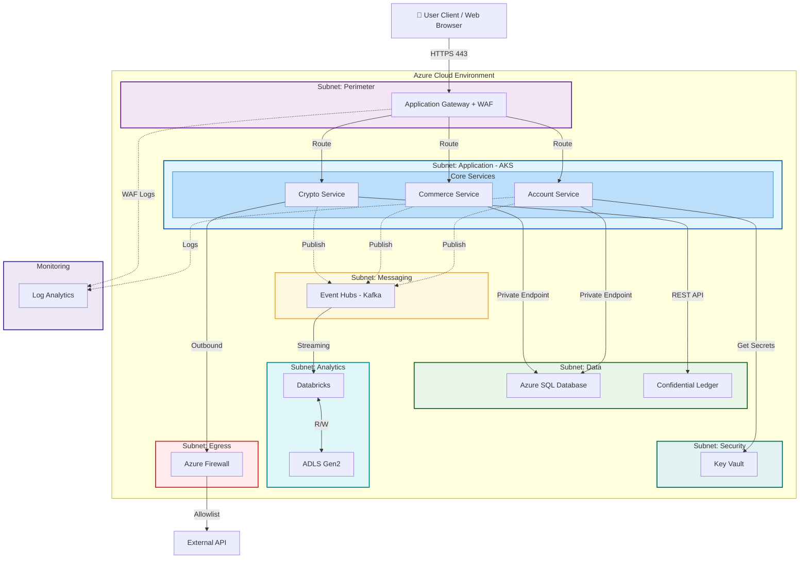

**User 경로 요약:**
1. **진입**: Client → AppGW(WAF 검사) → Core Service L7 라우팅
2. **데이터**: Service → SQL DB / Confidential Ledger (Private Endpoint)
3. **이벤트**: Service → Event Hubs (Pub/Sub) → Databricks (분석)
4. **보안**: Service → Key Vault (시크릿 조회)
5. **외부통신**: Service → Firewall → External API (Allowlist만 허용)

---

### Admin / Ops 경로 (Administration Flow)

> 관리자(BackOffice)와 운영자(Ops)의 접근 경로를 보여줍니다.

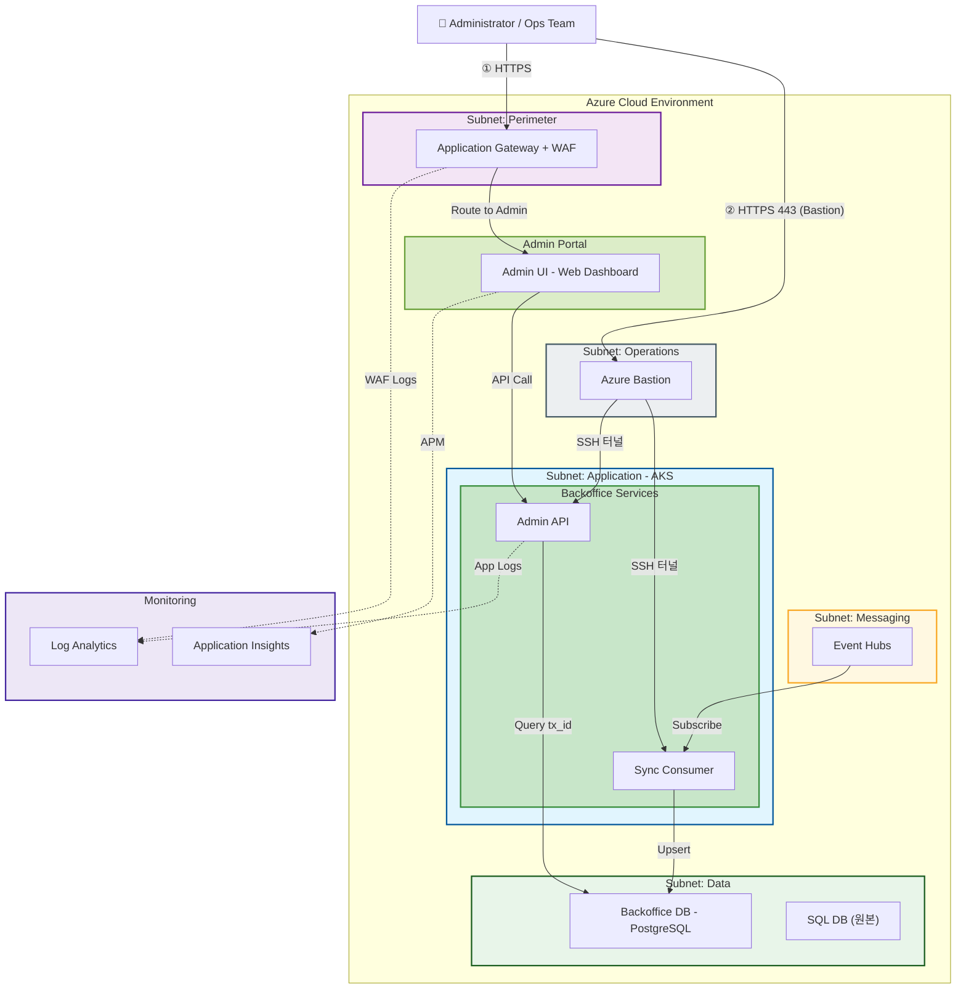

**Admin / Ops 경로 요약:**
1. **① Admin (BackOffice)**: Admin → AppGW → Admin UI → Admin API → Backoffice DB(tx_id 조회)
2. **② Ops (운영)**: Admin → Bastion(보안 SSH 터널) → AKS Node 직접 접근 (공인 IP 없음)
3. **Sync Pipeline**: Event Hubs → Sync Consumer → Backoffice DB(Upsert) — 원본 DB와 분리된 **읽기 전용 복제본**
4. **모니터링**: 모든 접근 기록이 Log Analytics + Application Insights로 수집

---

## 1. 범례 (Legend)

### 1.1 선 종류 (Line Types)

| 선 모양 | 의미 | 설명 |
|:---|:---|:---|
| **━━━ 실선 (Solid)** | **동기 통신 (Synchronous)** | API Call처럼 요청하고 응답을 **기다리는** 통신. DB 접속, 이미지 Pull, Secret 조회 등 |
| **┅┅┅ 점선 (Dotted)** | **비동기 통신 (Asynchronous)** | Pub/Sub처럼 메시지 던지고 **안 기다리는** 통신. Event Hubs, 로그 전송 등 |

### 1.2 Subnet 색상 (Subnet Colors)

| 색상 | 역할 | 주요 서비스 |
|:---|:---|:---|
| 🟣 보라색 | Perimeter (입구) | Azure Application Gateway + WAF |
| 🔵 파란색 | Application (앱) | AKS 클러스터 (Account, Commerce, Crypto) |
| 🩵 연파란색 | Core Services | Account, Commerce, Crypto 그룹 |
| 🟢 초록색 | Backoffice Services | Sync Consumer, Admin API |
| 🌿 연초록색 | Admin Portal | Admin UI (Web Dashboard) |
| 🟢 초록색 | Data (데이터) | Azure SQL, Backoffice DB (PostgreSQL), Confidential Ledger |
| 🟡 노란색 | Messaging (메시징) | Azure Event Hubs (Kafka) |
| 🩵 청록색 | Security (보안) | Key Vault, Container Registry, Private DNS |
| 🌊 시안색 | Analytics (분석) | Databricks, ADLS Gen2 |
| 🔴 빨간색 | Egress (외부통신) | Azure Firewall |
| ⬜ 회색 | Ops (운영) | Azure Bastion |

### 1.3 라벨 설명 (Label Descriptions)

| 라벨 | 발신자 | 수신자 | 설명 |
|:---|:---|:---|:---|
| `HTTPS 443` | Client | AppGW | 사용자가 웹사이트에 접속할 때 보내는 암호화된 요청 |
| `Route to Account` | AppGW | Account Service | WAF 통과 후 Account API로 라우팅 |
| `Route to Commerce` | AppGW | Commerce Service | WAF 통과 후 Commerce API로 라우팅 |
| `Route to Crypto` | AppGW | Crypto Service | WAF 통과 후 Crypto API로 라우팅 |
| `Route to Admin` | AppGW | Admin UI | WAF 통과 후 Admin 포털로 라우팅 |
| `API Call` | Admin UI | Admin API | 관리 대시보드에서 백오피스 API 호출 |
| `HTTPS 443 (Bastion)` | Admin | Bastion | 운영자가 Bastion PIP(443)으로 접속 후 SSH 터널 사용 |
| `Private Endpoint` | Service | Database | 인터넷 거치지 않고 내부망으로 DB 접속 |
| `REST API Append` | Crypto Service | Confidential Ledger | 원장에 기록 추가 (수정/삭제 불가) |
| `Publish Event` | Service | Event Hubs | 이벤트 발행 (비동기, Fire & Forget) |
| `Subscribe` | Event Hubs | Service | 이벤트 구독 (비동기, 나중에 처리) |
| `Upsert` | Sync Consumer | Backoffice DB | 이벤트 데이터를 백오피스 DB에 동기화 |
| `Query tx_id` | Admin API | Backoffice DB | 거래 ID 기반 백오피스 데이터 조회 |
| `Pull Image` | Service | Container Registry | 컨테이너 이미지 다운로드 |
| `Get Secrets` | Service | Key Vault | DB 비밀번호, API 키 등 조회 |
| `Outbound Request` | Service | Firewall | 외부 API 호출 시 방화벽 경유 |
| `Filtered Traffic` | Firewall | External API | 허용 목록(Allowlist)에 있는 외부로만 통신 |
| `Logs` | Service | Log Analytics | 애플리케이션 로그 전송 |
| `WAF Logs` | AppGW | Log Analytics | 웹 방화벽 차단/허용 로그 |
| `Network Logs` | Firewall | Log Analytics | 송수신 트래픽 감사 로그 |

---

## 2. 개요 (Overview)

### 2.1 시스템 목적

본 아키텍처는 **NSC(Next-generation Standard Commerce) 플랫폼**의 프로덕션 인프라 구성을 정의합니다. 스테이블코인 기반 글로벌 결제 시스템으로서, **금융 규제 수준의 보안성**과 **글로벌 트래픽 대응 확장성**을 동시에 달성하기 위해 Microsoft Azure 클라우드 위에 설계되었습니다.

| 항목 | 내용 |
|:---|:---|
| **플랫폼** | Microsoft Azure (Single VNet, Multi-Subnet) |
| **워크로드** | 결제(Commerce), 계정(Account), 암호화폐 원장(Crypto) |
| **컨테이너 오케스트레이션** | Azure Kubernetes Service (AKS) |
| **메시징** | Azure Event Hubs (Kafka Protocol) |
| **데이터 분석** | Azure Databricks + ADLS Gen2 (Lakehouse) |
| **백오피스** | Admin UI + Admin API + Sync Consumer |

### 2.2 설계 원칙 (Design Principles)

| 원칙 | 설명 | 적용 예시 |
|:---|:---|:---|
| **Zero Trust** | 모든 접근은 기본 차단, 명시적 허용만 통과 | Private Endpoint, WAF, Firewall Allowlist |
| **VNet 격리** | 단일 VNet 내 서브넷 분리로 Blast Radius 최소화 | 9개 서브넷 (Perimeter, App, Data, Security 등) |
| **Defense-in-Depth** | 입구(WAF) → 내부(NSG) → 출구(Firewall) 다층 방어 | Ingress: AppGW+WAF, Egress: Azure Firewall |
| **Pub/Sub 디커플링** | 서비스 간 직접 호출 대신 이벤트 기반 비동기 통신 | Event Hubs로 Commerce ↔ Account ↔ Crypto 연결 |
| **Delivery-first 실행** | 문서-실자원 드리프트는 현재 개발 블로커로 보지 않고 E2 게이트에서 정렬 | F3 개발 지속, E2-1 정렬 체크리스트에서 반영 |
| **Separation of Duties** | 운영(Bastion) / 사용자(AppGW) / 관리(Admin Portal) 접근 경로 분리 | 3개 독립 Ingress 경로 |

### 2.3 인프라 구성 요약

본 시스템은 **9개 서브넷**과 **VNet 외부 모니터링 레이어**로 구성됩니다. AKS를 제외한 대부분의 리소스가 **Azure PaaS**이며, VNet 통합 여부에 따라 아래와 같이 분류됩니다.

| 배포 모델 | 리소스 | 비고 |
|:---|:---|:---|
| **VNet 통합 PaaS** | Application Gateway, Event Hubs, SQL DB, PostgreSQL, Confidential Ledger, Key Vault, ACR, Private DNS, Databricks, ADLS Gen2, Bastion, Firewall | 서브넷 내 배포 또는 Private Endpoint |
| **VNet 외부 PaaS** | Log Analytics Workspace, Application Insights | 서브넷 불필요, 에이전트 기반 수집 |
| **IaaS/CaaS** | AKS (Node Pool VM) | 워커 노드는 VM 기반 |

#### 2.3.1 레이어별 리소스 목록

| Layer | 서브넷 / 레이어 | Azure 리소스 | 서비스 유형 | 역할 |
|:---|:---|:---|:---|:---|
| 1 | **Public Internet Zone** | — | — | 사용자(Client) 및 관리자(Admin) 접근 기점 |
| 2 | **Perimeter** | Azure Application Gateway | PaaS (L7 LB) | HTTPS 수신, URL 기반 라우팅 |
|   |   | Web Application Firewall (WAF) | PaaS (보안) | OWASP 룰 기반 악성 요청 차단 |
| 3 | **Application** | Azure Kubernetes Service (AKS) | CaaS | 마이크로서비스 컨테이너 오케스트레이션 |
|   |   | Account Service | App (Spring Boot) | 회원 관리, 인증/인가 |
|   |   | Commerce Service | App (Spring Boot) | 결제, 주문 처리 |
|   |   | Crypto Service | App (FastAPI) | 암호화폐 원장 연동, 토큰 관리 |
|   |   | Sync Consumer | App (BackOffice) | Event Hubs 이벤트 → Backoffice DB 동기화 |
|   |   | Admin API | App (BackOffice) | 백오피스 관리 API |
|   | **Admin Portal** | Admin UI (Web Dashboard) | Web App | 운영 관리 대시보드 |
|   | **Operations** | Azure Bastion | PaaS | 공인 IP 없이 SSH/RDP 보안 터널 제공 |
| 4 | **Messaging** | Azure Event Hubs | PaaS | Kafka 프로토콜 기반 이벤트 스트리밍 |
| 5 | **Data** | Azure SQL Database | PaaS (RDBMS) | Account/Commerce 트랜잭션 데이터 |
|   |   | Backoffice DB (PostgreSQL) | PaaS (RDBMS) | 백오피스 조회용 데이터 복제본 |
|   |   | Azure Confidential Ledger | PaaS (원장) | 변조 불가능한 암호화폐 거래 기록 |
| 6 | **Security** | Azure Key Vault | PaaS | 비밀번호, API 키, 인증서 관리 |
|   |   | Azure Container Registry | PaaS | 프라이빗 컨테이너 이미지 저장소 |
|   |   | Azure Private DNS Zone | PaaS | Private Endpoint용 내부 DNS 이름 해석 |
| 7 | **Analytics** | Azure Databricks | PaaS (Spark) | 실시간/배치 ETL, 데이터 분석 |
|   |   | Azure Data Lake Storage Gen2 | PaaS (Storage) | Lakehouse 원시/정제 데이터 저장소 |
| 8 | **Egress** | Azure Firewall | PaaS (L3/L4) | 아웃바운드 트래픽 필터링, Allowlist 제어 |
| 9 | **Monitoring** (VNet 외부) | Azure Log Analytics Workspace | PaaS | 로그 수집, KQL 쿼리, 알림 |
|   |   | Azure Application Insights | PaaS | APM, 요청 추적, 성능 모니터링 |
|   | **External** | External API (Allowlist) | 외부 | Firewall Allowlist를 통해서만 접근 가능 |

> **총 리소스**: Azure 관리형 서비스 **17종** + 애플리케이션 서비스 **5종** + 외부 연동 **1종** = **23종**

### 2.4 트래픽 흐름 분류 (Traffic Flow Categories)


트래픽 흐름은 **10개 카테고리**로 분류됩니다.

```
┌─────────────────────────────────────────────────────┐
│                Public Internet Zone                 │
│            (Client, Administrator)                  │
└────────────────────┬────────────────────────────────┘
                     │ HTTPS 443
┌────────────────────▼────────────────────────────────┐
│  Azure Cloud Environment - Single VNet              │
│                                                     │
│  ┌─ Perimeter ──────────────────────────────────┐   │
│  │  Application Gateway + WAF                   │   │
│  └──────────────────┬───────────────────────────┘   │
│                     │                               │
│  ┌─ Application ────▼───────┐  ┌─ Admin Portal ┐   │
│  │  Core: Account,Commerce, │  │  Admin UI      │   │
│  │        Crypto             │  └───────┬───────┘   │
│  │  BackOffice: SyncConsumer,│          │           │
│  │              AdminAPI     │◄─────────┘           │
│  └──────────────┬───────────┘                       │
│                 │ Publish Event                      │
│  ┌─ Messaging ──▼───────────────────────────────┐   │
│  │  Event Hubs (Kafka Protocol)                 │   │
│  └──────────────┬───────────────────────────────┘   │
│                 │                                   │
│  ┌─ Data ───────▼───────────────────────────────┐   │
│  │  SQL DB │ Backoffice DB │ Confidential Ledger│   │
│  └──────────────┬───────────────────────────────┘   │
│                 │                                   │
│  ┌─ Security ───┴───────┐  ┌─ Egress ──────────┐   │
│  │  Key Vault, ACR, DNS │  │  Azure Firewall   │───┼──► External API
│  └──────────────────────┘  └───────────────────┘   │
│                                                     │
│  ┌─ Analytics ──────────────────────────────────┐   │
│  │  Databricks ◄──► ADLS Gen2 (Lakehouse)       │   │
│  └──────────────────────────────────────────────┘   │
│                                                     │
│  ┌─ Operations ─────────────────────────────────┐   │
│  │  Azure Bastion (HTTPS 443 → SSH Tunnel)   │   │
│  └──────────────────────────────────────────────┘   │
└─────────────────────────────────────────────────────┘
                     │ Logs
┌────────────────────▼────────────────────────────────┐
│  Azure Monitoring (PaaS)                            │
│  Log Analytics Workspace │ Application Insights     │
└─────────────────────────────────────────────────────┘
```

### 2.4(b) 트래픽 흐름 상세 분류 (Traffic Flow Categories — Detail)

| # | 카테고리 | 방향 | 프로토콜 | 설명 |
|:---|:---|:---|:---|:---|
| 1 | **User Ingress** | 외부 → 내부 | HTTPS | 사용자 웹 요청 → AppGW → AKS |
| 2 | **Admin Ingress** | 외부 → 내부 | HTTPS | 관리자 → AppGW → Admin UI → Admin API |
| 3 | **Admin Ops** | 외부 → 내부 | SSH | 운영자 → Bastion → AKS 노드 |
| 4 | **App → DB** | 내부 | Private Link | 서비스 → SQL/Ledger (Private Endpoint) |
| 5 | **Messaging** | 내부 | Kafka | 서비스 ↔ Event Hubs (Pub/Sub) |
| 6 | **Backoffice** | 내부 | Kafka+SQL | Event Hubs → SyncConsumer → Backoffice DB |
| 7 | **Analytics** | 내부 | Spark | Event Hubs/SQL → Databricks ↔ ADLS Gen2 |
| 8 | **Security** | 내부 | HTTPS | 서비스 → Key Vault / ACR |
| 9 | **Egress** | 내부 → 외부 | HTTPS | 서비스 → Firewall → External API |
| 10 | **Monitoring** | 내부 → PaaS | Agent | 서비스/Firewall/AppGW → Log Analytics |

### 2.5 서브넷 구성 (Subnet Inventory)

Single VNet 내 **9개 서브넷**의 구성은 다음과 같습니다.

| # | 서브넷 이름 | 주요 리소스 | 네트워크 제어 | 목적 |
|:---|:---|:---|:---|:---|
| 1 | **Perimeter** | Application Gateway + WAF | NSG, Public IP | 외부 HTTPS 트래픽 수신 및 L7 라우팅 |
| 2 | **Application** | AKS (Account, Commerce, Crypto, SyncConsumer, Admin API) | NSG, UDR | 컨테이너화된 마이크로서비스 실행 |
| 3 | **Admin Portal** | Admin UI (Web Dashboard) | NSG | 운영 관리 대시보드 호스팅 |
| 4 | **Messaging** | Event Hubs (Kafka Protocol) | NSG, Private Endpoint | 이벤트 스트리밍 메시지 브로커 |
| 5 | **Data** | SQL Database, Backoffice DB (PostgreSQL), Confidential Ledger | Private Endpoint, NSG | 트랜잭션/원장 데이터 저장 |
| 6 | **Security** | Key Vault, Container Registry, Private DNS Zone | Private Endpoint | 시크릿 관리, 이미지 저장, DNS 해석 |
| 7 | **Analytics** | Databricks, ADLS Gen2 | VNet Injection, Private Endpoint | 데이터 레이크하우스 및 ETL 처리 |
| 8 | **Egress** | Azure Firewall | UDR, Public IP | 아웃바운드 트래픽 필터링 및 SNAT |
| 9 | **Operations** | Azure Bastion | NSG | 공인 IP 없이 VM/AKS 노드 보안 접근 |

> **참고**: 위 서브넷 이름은 논리적 역할 기준 명칭입니다. 실제 Azure 배포 시 CIDR 블록 및 Naming Convention은 Terraform IaC 코드에 따릅니다.

---

## 3. 세부 서브넷 상호작용 다이어그램 (Subnet Interaction Diagrams)

> 전체 아키텍처를 **5개 관점**으로 분리하여, 각 서브넷 간 상호작용을 집중적으로 보여줍니다.

---

### 3.1 Ingress & 라우팅 (진입 경로)

> **관련 서브넷**: Public Zone → Perimeter → Application + Admin Portal + Operations
> **핵심 포인트**: 시스템에 진입하는 **3개의 독립된 경로** (User, Admin, Ops)

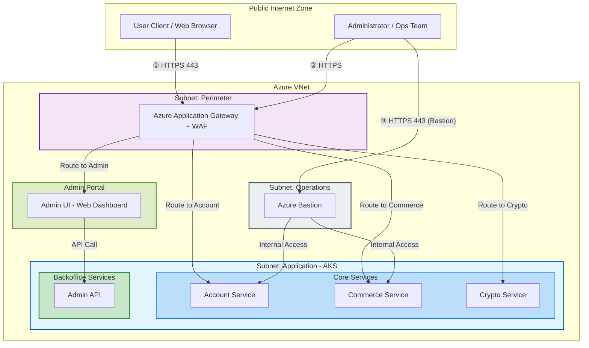

**흐름 설명:**
1. **① User Ingress**: 사용자 → AppGW(WAF 검사) → 각 Core Service로 L7 라우팅
2. **② Admin Ingress**: 관리자 → AppGW → Admin UI → Admin API 호출
3. **③ Ops Access**: 운영자 → Bastion(보안 터널) → AKS 노드 직접 접근 (공인 IP 없음)

---

### 3.2 데이터 접근 (Application → Data)

> **관련 서브넷**: Application → Data + Backoffice Pipeline
> **핵심 포인트**: 모든 DB 접근은 **Private Endpoint**를 통한 내부 통신만 허용

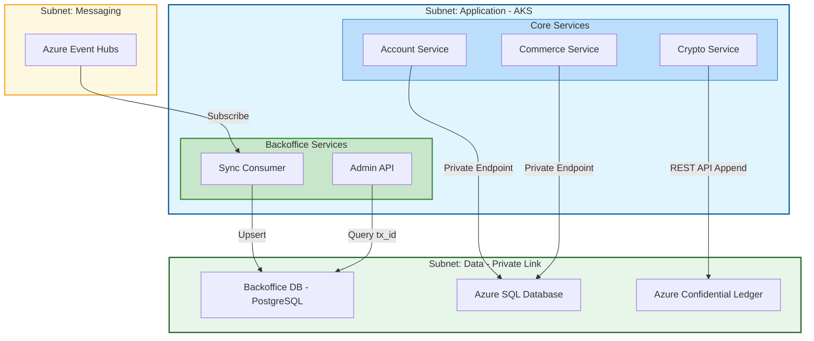

**흐름 설명:**
1. **Account/Commerce → SQL DB**: Private Endpoint를 통한 트랜잭션 읽기/쓰기
2. **Crypto → Confidential Ledger**: REST API로 변조 불가능한 원장에 Append Only
3. **Backoffice Pipeline**: Event Hubs → Sync Consumer가 이벤트를 받아 Backoffice DB에 Upsert → Admin API가 tx_id로 조회

---

### 3.3 이벤트 & 분석 (Event Streaming → Analytics)

> **관련 서브넷**: Application → Messaging → Analytics ← Data
> **핵심 포인트**: Pub/Sub 비동기 통신과 **실시간/배치 데이터 파이프라인**

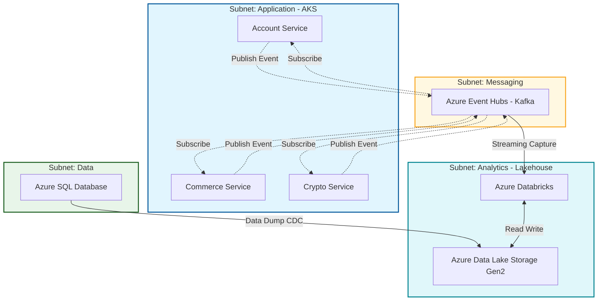

**흐름 설명:**
1. **Pub/Sub**: 각 서비스가 이벤트를 발행(Publish)하고, 필요한 서비스가 구독(Subscribe)
2. **실시간**: Event Hubs → Databricks Streaming Capture로 실시간 분석
3. **배치**: SQL DB → ADLS Gen2로 일일 CDC 덤프 → Databricks ETL
4. **점선(─ ─ ─)** = 비동기 통신, **실선(───)** = 동기 통신

---

### 3.4 보안 & 외부통신 (Security + Egress)

> **관련 서브넷**: Application → Security + Egress → External API
> **핵심 포인트**: 시크릿/이미지 접근과 **아웃바운드 트래픽 제어**

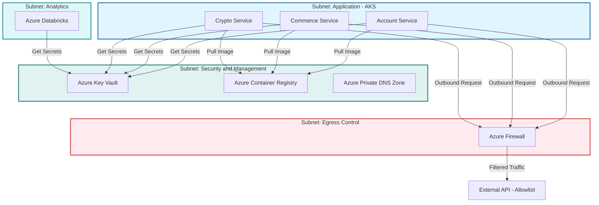

**흐름 설명:**
1. **Key Vault**: 모든 서비스 + Databricks는 DB 비밀번호/API 키를 Key Vault에서 동적 조회 (하드코딩 금지)
2. **Container Registry**: AKS Pod 시작 시 프라이빗 ACR에서만 이미지 Pull (Docker Hub 차단)
3. **Private DNS Zone**: Private Endpoint의 내부 DNS 이름 해석 담당
4. **Azure Firewall**: 모든 아웃바운드 트래픽은 Firewall 경유, **Allowlist에 등록된 외부 API만 통과**

---

### 3.5 모니터링 (Monitoring)

> **관련 서브넷**: Perimeter + Application + Analytics + Egress → Monitoring (VNet 외부)
> **핵심 포인트**: 모든 레이어의 로그가 **단일 Log Analytics Workspace**로 수집되는 **횡단 관심사**

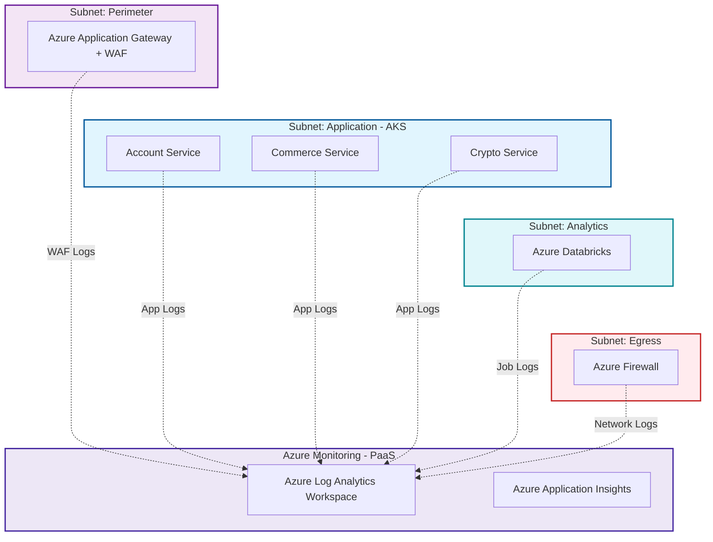

**흐름 설명:**
1. **App Logs**: 각 마이크로서비스의 애플리케이션 로그 (요청/응답, 에러, 추적)
2. **WAF Logs**: Application Gateway에서 차단/허용된 HTTP 요청 감사 로그
3. **Network Logs**: Firewall의 아웃바운드 트래픽 허용/차단 감사 로그
4. **Job Logs**: Databricks Spark 작업 실행 로그
5. **Application Insights**: APM 기반 요청 추적, 성능 메트릭, 장애 감지
6. **모든 로그는 점선(─ ─ ─)**: 비동기 에이전트 기반 수집, 서비스 성능에 영향 없음

---

## 4. 네트워크 규칙 (Network Rules)

> 모든 서브넷은 **기본 Deny** 정책을 따르며, 아래 명시된 규칙만 허용됩니다.

### 4.1 NSG 규칙 매트릭스 (서브넷 간 허용/차단)

> 행(Source) → 열(Destination) 방향으로 읽습니다. ✅ = 허용, ❌ = 차단, — = 해당 없음

| Source ↓ \ Dest → | Perimeter | Application | Admin Portal | Messaging | Data | Security | Analytics | Egress | Ops |
|:---|:---:|:---:|:---:|:---:|:---:|:---:|:---:|:---:|:---:|
| **Internet** | ✅ 443 | ❌ | ❌ | ❌ | ❌ | ❌ | ❌ | ❌ | ❌ |
| **Perimeter** | — | ✅ 8443 (TLS) | ✅ 443 | ❌ | ❌ | ❌ | ❌ | ❌ | ❌ |
| **Application** | ❌ | — | ❌ | ✅ 9093 | ✅ 1433/5432/443 | ✅ 443 | ❌ | ✅ Any | ❌ |
| **Admin Portal** | ❌ | ✅ 8443 (TLS) | — | ❌ | ❌ | ❌ | ❌ | ❌ | ❌ |
| **Messaging** | ❌ | ✅ 9093 | ❌ | — | ❌ | ❌ | ✅ 443 | ❌ | ❌ |
| **Data** | ❌ | ❌ | ❌ | ❌ | — | ❌ | ✅ 443 | ❌ | ❌ |
| **Security** | ❌ | ❌ | ❌ | ❌ | ❌ | — | ❌ | ❌ | ❌ |
| **Analytics** | ❌ | ❌ | ❌ | ❌ | ✅ 443 | ✅ 443 | — | ✅ Any | ❌ |
| **Egress** | ❌ | ❌ | ❌ | ❌ | ❌ | ❌ | ❌ | — | ❌ |
| **Ops** | ❌ | ✅ 22 | ❌ | ❌ | ❌ | ❌ | ❌ | ❌ | — |

**주요 규칙 설명:**

| 규칙 | Source | Dest | Port | 설명 |
|:---|:---|:---|:---|:---|
| Ingress 허용 | Internet | Perimeter | 443 (HTTPS) | 유일한 애플리케이션 트래픽 진입점 (Application-Plane), Management-Plane은 Bastion PIP 경유 |
| 서비스 라우팅 | Perimeter | Application | 8443 (HTTPS) | AppGW → AKS 서비스 포트 (End-to-End TLS) |
| Admin 라우팅 | Perimeter | Admin Portal | 443 | AppGW → Admin UI |
| Kafka 통신 | Application ↔ Messaging | 양방향 | 9093 (TLS) | Event Hubs Kafka 프로토콜 |
| DB 접근 | Application | Data | 1433/5432/443 | SQL(1433), PostgreSQL(5432), Ledger(443) |
| Secrets 조회 | Application | Security | 443 | Key Vault, ACR API |
| SSH 접근 | Ops | Application | 22 | Bastion → AKS Node SSH |
| 아웃바운드 | Application | Egress | Any | Firewall으로 라우팅 (UDR) |

**NSG 규칙 흐름도:**

> `test09_nsg_main.tf`, `test08_bastion_main.tf` 기반 — 실제 Terraform에서 검증된 패턴

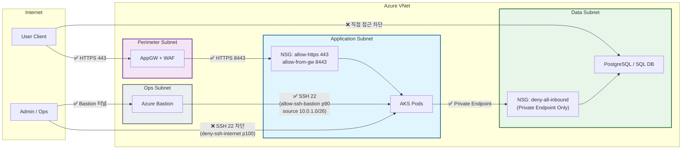

### 4.2 UDR 라우팅 테이블 (User Defined Routes)

> 특정 서브넷의 아웃바운드 트래픽을 Azure Firewall로 강제 전달합니다.

| 서브넷 | Route Name | Address Prefix | Next Hop Type | Next Hop IP | 목적 |
|:---|:---|:---|:---|:---|:---|
| **Application** | `route-to-firewall` | `0.0.0.0/0` | Virtual Appliance | Firewall Private IP | 모든 외부 트래픽 Firewall 경유 강제 |
| **Analytics** | `route-to-firewall` | `0.0.0.0/0` | Virtual Appliance | Firewall Private IP | Databricks 외부 통신 제어 |
| **Data** | `route-to-firewall` | `0.0.0.0/0` | Virtual Appliance | Firewall Private IP | DB 외부 유출 방지 (※ PaaS Only — 아웃바운드 트래픽 없음, 방어적 설정) |

> **결과**: UDR이 적용된 서브넷에서 나가는 모든 트래픽은 Azure Firewall을 반드시 거치며, Firewall Allowlist에 등록되지 않은 목적지는 **자동 차단**됩니다.

**Egress 강제 터널링 흐름도:**

> `test12_firewall_main.tf` 기반 — UDR + Firewall Allowlist + Log Analytics 실제 구현

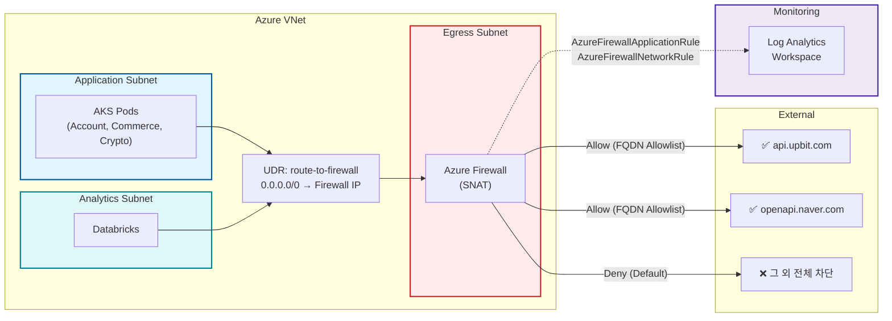

### 4.3 Private Endpoint 매핑

> VNet 내부에서만 접근 가능하도록 Private Endpoint가 구성된 리소스 목록입니다.

| Azure 리소스 | Private Endpoint 서브넷 | Private DNS Zone | Private IP 예시 |
|:---|:---|:---|:---|
| Azure SQL Database | Data | `privatelink.database.windows.net` | `10.0.4.10` |
| Backoffice DB (PostgreSQL) | Data | `privatelink.postgres.database.azure.com` | `10.0.4.11` |
| Azure Confidential Ledger | Data | `privatelink.confidential-ledger.azure.com` | `10.0.4.12` |
| Azure Key Vault | Security | `privatelink.vaultcore.azure.net` | `10.0.5.10` |
| Azure Container Registry | Security | `privatelink.azurecr.io` | `10.0.5.11` |
| Azure Event Hubs | Messaging | `privatelink.servicebus.windows.net` | `10.0.3.10` |
| Azure Data Lake Storage Gen2 | Analytics | `privatelink.dfs.core.windows.net` | `10.0.6.10` |

> **효과**: 위 리소스들은 공인 IP를 통한 접근이 **완전 차단**되며, VNet 내부 Private IP로만 접근 가능합니다. Private DNS Zone이 내부 이름 해석을 담당합니다.

---

## 5. 보안 규칙 (Security Rules)

> 인프라 보안은 **인증/인가**, **시크릿 관리**, **경계 방어** 3가지 축으로 구성됩니다.

### 5.1 인증/인가 매트릭스 (RBAC)

> "누가, 무엇에, 어떻게 접근하는가"를 역할 기반으로 정리합니다.

| 역할 | 접근 경로 | 접근 대상 | 권한 수준 | 인증 방식 |
|:---|:---|:---|:---|:---|
| **User (Client)** | Internet → AppGW → Core Services | Account, Commerce, Crypto API | Read/Write (API 범위 내) | Azure AD B2C + OAuth 2.0 |
| **Admin (Ops)** | Internet → Bastion → AKS Node | AKS 워커 노드 (SSH) | Admin (Shell 접근) | Azure AD + MFA |
| **Admin (BackOffice)** | Internet → AppGW → Admin UI → Admin API | Backoffice DB 조회 | Read/Write (관리 범위) | Azure AD + RBAC |
| **Service (AKS Pod)** | 내부 네트워크 | Key Vault, ACR, SQL DB | Managed Identity 기반 | Workload Identity Federation |
| **Service (AKS Pod → Event Hubs)** | 내부 네트워크 | Event Hubs (Kafka) | Kafka SASL_SSL | Connection String (Key Vault) |
| **Databricks** | 내부 네트워크 | Key Vault, ADLS Gen2 | Managed Identity | Workload Identity (Unity Catalog) |
| **CI/CD Pipeline** | GitHub Actions → Azure | ACR (Push), AKS (Deploy) | Contributor (제한) | Service Principal + OIDC |

**핵심 원칙:**
- **인증 원칙 (Identity-First)**: Azure 서비스 간은 Managed Identity 우선, 외부 API 및 Kafka SASL 인증은 Key Vault 시크릿 사용
- **최소 권한 원칙 (Least Privilege)**: 각 역할은 필요한 최소 권한만 부여
- **MFA 강제**: 운영자(Admin) 접근 시 다중 인증 필수

### 5.2 시크릿 관리 정책

> 모든 민감 정보는 Azure Key Vault에서 중앙 관리됩니다.

| 항목 | 정책 | 비고 |
|:---|:---|:---|
| **저장 위치** | Azure Key Vault | 코드/환경변수 하드코딩 **절대 금지** |
| **접근 방식** | Managed Identity | 비밀번호 없이 Azure AD 토큰 기반 접근 |
| **접근 제어** | RBAC (Key Vault Secrets User) | 역할별 Secret 읽기 권한 분리 |
| **순환 주기** | 90일 자동 갱신 | Azure Automation 또는 Event Grid 트리거 |
| **Purge Protection** | ✅ 활성화 (90일) | 실수/악의적 삭제 후 복구 가능 |
| **Soft Delete** | ✅ 활성화 | 삭제된 Secret 복원 가능 |
| **네트워크 격리** | Private Endpoint Only | 공인 IP 접근 차단 |

**Key Vault에 저장되는 시크릿 목록:**

| 시크릿 이름 (예시) | 용도 | 사용 서비스 | MI 대체 여부 |
|:---|:---|:---|:---|
| `sql-connection-string` | Azure SQL DB 접속 문자열 | Account, Commerce | ⚠️ MI 대체 가능 (`DefaultAzureCredential`) |
| `postgresql-connection-string` | Backoffice DB 접속 문자열 | Sync Consumer, Admin API | ⚠️ MI 대체 가능 (`azure.identity`) |
| `eventhubs-connection-string` | Event Hubs Kafka 인증 정보 | 모든 마이크로서비스 | ✅ 유지 (Kafka SASL_SSL 필수) |
| `ledger-client-cert` | Confidential Ledger 클라이언트 인증서 (PEM) | Crypto Service | ✅ 유지 (Certificate auth) |
| `acr-login-credential` | Container Registry 인증 (backup) | AKS | ❌ 제거 예정 (`az aks update --attach-acr`로 MI 대체) |
| `databricks-token` | Databricks Workspace 접근 토큰 | ETL 파이프라인 | ✅ 유지 (CI/CD REST API PAT) |
| `upbit-api-key` | Upbit 시세 API 인증 키 | Crypto Service | ✅ 유지 (외부 API) |
| `naver-api-client-id` | Naver Open API Client ID/Secret | 연동 서비스 | ✅ 유지 (외부 API) |

**Key Vault 시크릿 참조 흐름도:**

> `test06_keyvault_main.tf` 기반 — Key Vault + Databricks Secret Scope + API Key 연동 실제 구현

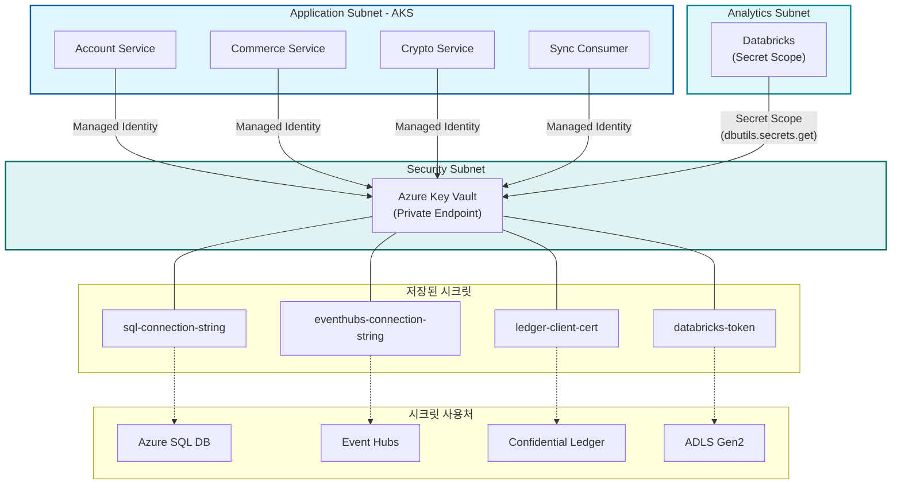

### 5.3 WAF / Firewall 규칙 요약

> 입구(Ingress)와 출구(Egress)에서의 트래픽 필터링 규칙입니다.

#### 5.3.1 WAF 규칙 (Ingress — Application Gateway)

| 항목 | 설정 | 설명 |
|:---|:---|:---|
| **Mode** | Prevention | 탐지가 아닌 실시간 **차단** |
| **Rule Set** | OWASP CRS 3.2 | 업계 표준 웹 공격 방어 룰셋 |
| **Max Request Body Size** | 128 KB | 대용량 페이로드 공격 차단 |
| **File Upload Limit** | 100 MB | 비정상 파일 업로드 방지 |

**차단 대상 공격:**

| 공격 유형 | OWASP Rule ID | 설명 |
|:---|:---|:---|
| SQL Injection | 942xxx | DB 쿼리 조작 시도 차단 |
| Cross-Site Scripting (XSS) | 941xxx | 악성 스크립트 삽입 차단 |
| Remote File Inclusion (RFI) | 931xxx | 외부 파일 실행 시도 차단 |
| Local File Inclusion (LFI) | 930xxx | 서버 내부 파일 접근 차단 |
| Command Injection | 932xxx | OS 명령어 실행 시도 차단 |
| Protocol Attack | 921xxx | HTTP 프로토콜 위반 차단 |

#### 5.3.2 Firewall 규칙 (Egress — Azure Firewall)

> **기본 정책: 전체 차단 (Deny All)** — 아래 Allowlist에 등록된 FQDN만 허용

**Application Rules (FQDN Allowlist):**

| 우선순위 | Rule Name | Source | FQDN (목적지) | Protocol | 용도 |
|:---|:---|:---|:---|:---|:---|
| 100 | `allow-azure-auth` | Application Subnet | `login.microsoftonline.com` | HTTPS | Azure AD 인증 |
| 200 | `allow-acr` | Application Subnet | `*.azurecr.io` | HTTPS | Container Registry 이미지 Pull |
| 300 | `allow-keyvault` | Application Subnet | `*.vault.azure.net` | HTTPS | Key Vault API 접근 |
| 400 | `allow-eventhubs` | Application Subnet | `*.servicebus.windows.net` | Kafka (SASL_SSL, 9093) | Event Hubs Kafka 통신 (※ PE 구성 시 dead rule — Defense-in-Depth 용) |
| 500 | `allow-crypto-api` | Application Subnet *(Crypto Service — Calico 제한)* | `api.upbit.com` | HTTPS | 암호화폐 시세 API (Naver-Dunamu) |
| 550 | `allow-naver-api` | Application Subnet | `openapi.naver.com` | HTTPS | Naver 오픈 API 연동 |
| 600 | `allow-databricks` | Analytics Subnet | `*.azuredatabricks.net` | HTTPS | Databricks Control Plane |
| 900 | `allow-monitoring` | All Subnets | `*.monitor.azure.com` | HTTPS | Azure Monitor 메트릭 전송 |

**Network Rules:**

| 우선순위 | Rule Name | Source | Destination | Port | 용도 |
|:---|:---|:---|:---|:---|:---|
| 100 | `allow-dns` | All Subnets | `168.63.129.16` | 53 (UDP) | Azure 내부 DNS |
| 200 | `allow-ntp` | All Subnets | `*` | 123 (UDP) | 시간 동기화 (NTP) |

**DNAT Rules:**

| 규칙 | 없음 | — | — | — | Firewall DNAT 미사용. **애플리케이션 인바운드 = AppGW(443)**, **운영 인바운드 = Bastion PIP(443)** 경유 |
|:---|:---|:---|:---|:---|:---|

> **감사 로그**: Firewall의 모든 허용/차단 이벤트는 Log Analytics Workspace로 전송되어 KQL 쿼리로 분석 가능합니다.

---

## 6. 비즈니스 흐름도 (Business Flow Diagrams)

> 3장의 서브넷 상호작용 다이어그램이 **네트워크 관점**이라면, 6장은 **비즈니스 로직 관점**으로 데이터가 시스템을 통과하는 여정을 보여줍니다.

---

### 6.1 데이터 흐름도 (Data Flow)

> **목적**: 사용자 요청이 들어와서 DB에 저장되고, 분석 시스템까지 도달하는 **데이터의 여정**을 보여줍니다.

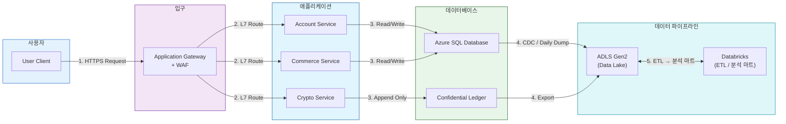

**흐름 설명:**
1. 사용자가 웹사이트에 요청을 보냅니다.
2. Application Gateway가 WAF 검사 후 적절한 마이크로서비스로 라우팅합니다.
3. 각 서비스가 자신의 DB에 데이터를 읽고/씁니다 (Private Endpoint 경유).
4. DB의 데이터가 Data Lake로 복사됩니다 (**CDC** = 실시간 변경 캡처, **Daily Dump** = 일일 배치).
5. Databricks가 **Medallion Architecture** (Bronze → Silver → Gold) ETL을 수행해 분석 마트를 생성합니다.

---

### 6.2 이벤트 흐름도 (Event Flow)

> **목적**: Pub/Sub 기반의 **비동기 이벤트 통신**과 Kafka 토픽 매핑을 보여줍니다.

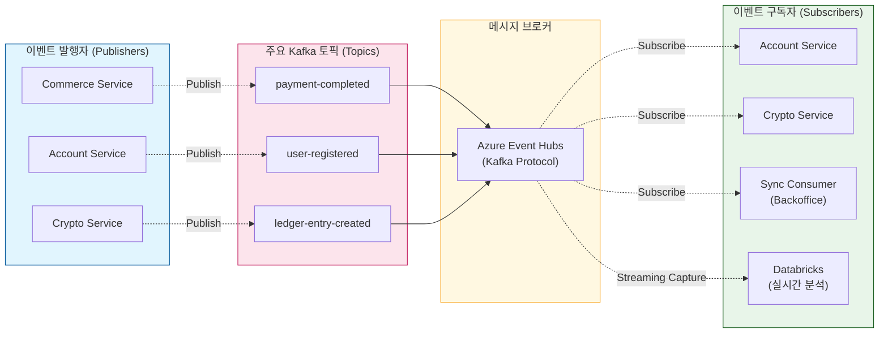

**흐름 설명:**
1. **Commerce**가 결제 완료 시 `payment-completed` 이벤트를 발행합니다.
2. **Account**가 회원 가입 시 `user-registered` 이벤트를 발행합니다.
3. **Crypto**가 원장 기록 시 `ledger-entry-created` 이벤트를 발행합니다.
4. 각 서비스는 자기에게 필요한 이벤트만 **구독(Subscribe)**하여 처리합니다.
5. **Sync Consumer**가 이벤트를 구독하여 Backoffice DB에 Upsert합니다.
6. **Databricks**도 이벤트를 Streaming Capture하여 실시간 분석에 활용합니다.

**예시 시나리오:**
> Commerce: "결제 끝났어!" ➞ Account: "포인트 적립할게" + Crypto: "장부에 기록할게" + SyncConsumer: "Backoffice DB에 동기할게" + Databricks: "실시간 대시보드 업데이트"

---

### 6.3 에러 및 재시도 흐름도 (Error & Retry Flow)

> **목적**: 6.1~6.2가 **정상 경로(Happy Path)**를 다루었다면, 6.3은 **실패 시 복구 메커니즘**을 보여줍니다.

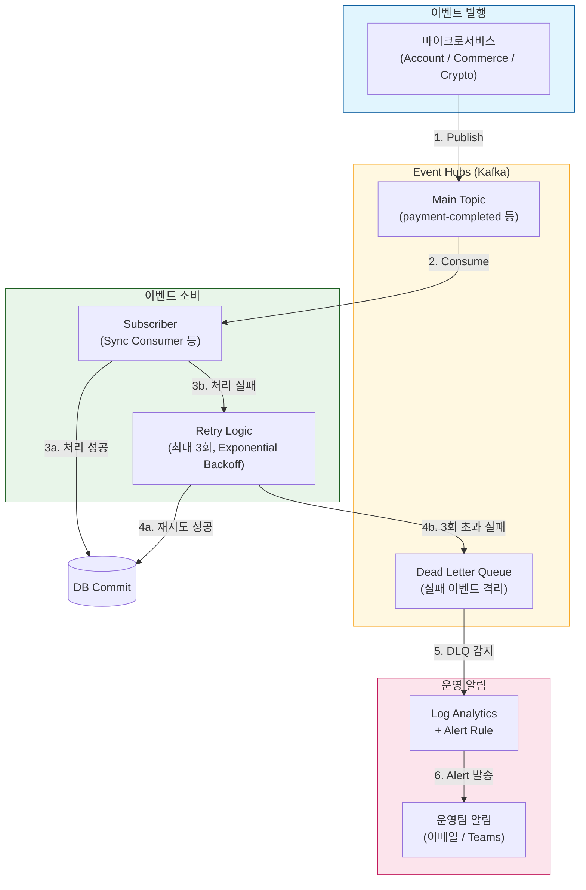

**흐름 설명:**

| 단계 | 동작 | 설명 |
|:---|:---|:---|
| 1~2 | 정상 발행/소비 | 6.2와 동일한 Pub/Sub 흐름 |
| 3a | 처리 성공 | DB에 정상 Commit, 완료 |
| 3b → 4a | 실패 → 재시도 성공 | **Exponential Backoff** (1초 → 2초 → 4초) 간격으로 최대 3회 재시도 |
| 4b | 3회 초과 실패 | **Dead Letter Queue(DLQ)**에 격리 — 메인 큐를 막지 않음 |
| 5~6 | 운영 알림 | Log Analytics Alert Rule이 DLQ 적재를 감지하여 운영팀에 알림 |

> **Dead Letter Queue(DLQ)란?** 처리에 반복적으로 실패한 메시지를 격리하는 **별도 큐**입니다. 쉽게 말해 "배달 불가 우편함"입니다. 메인 큐에서 빼서 따로 보관하므로 **정상 메시지의 처리를 방해하지 않습니다.**

**재시도 정책 요약:**

| 항목 | 설정값 |
|:---|:---|
| 최대 재시도 횟수 | 3회 |
| 재시도 간격 | Exponential Backoff (1s → 2s → 4s) |
| DLQ 이동 조건 | 3회 초과 실패 또는 메시지 크기 초과 |
| DLQ 알림 | Log Analytics → Action Group → 이메일/Teams |
| DLQ 보존 기간 | 7일 (수동 재처리 또는 폐기) |

---

### 6.4 분산 트랜잭션 패턴 (TCC / Saga Pattern)

> **목적**: Account, Commerce, Crypto **3개 서비스에 걸친 트랜잭션**의 일관성을 어떻게 보장하는지 보여줍니다.

> **왜 필요한가?** 마이크로서비스에서는 하나의 DB 트랜잭션으로 3개 서비스를 묶을 수 없습니다. 대신 **TCC(Try-Confirm-Cancel)** 패턴으로 각 서비스가 독립적으로 참여하되, 하나라도 실패하면 **보상 트랜잭션(Compensating Transaction)**으로 되돌립니다.

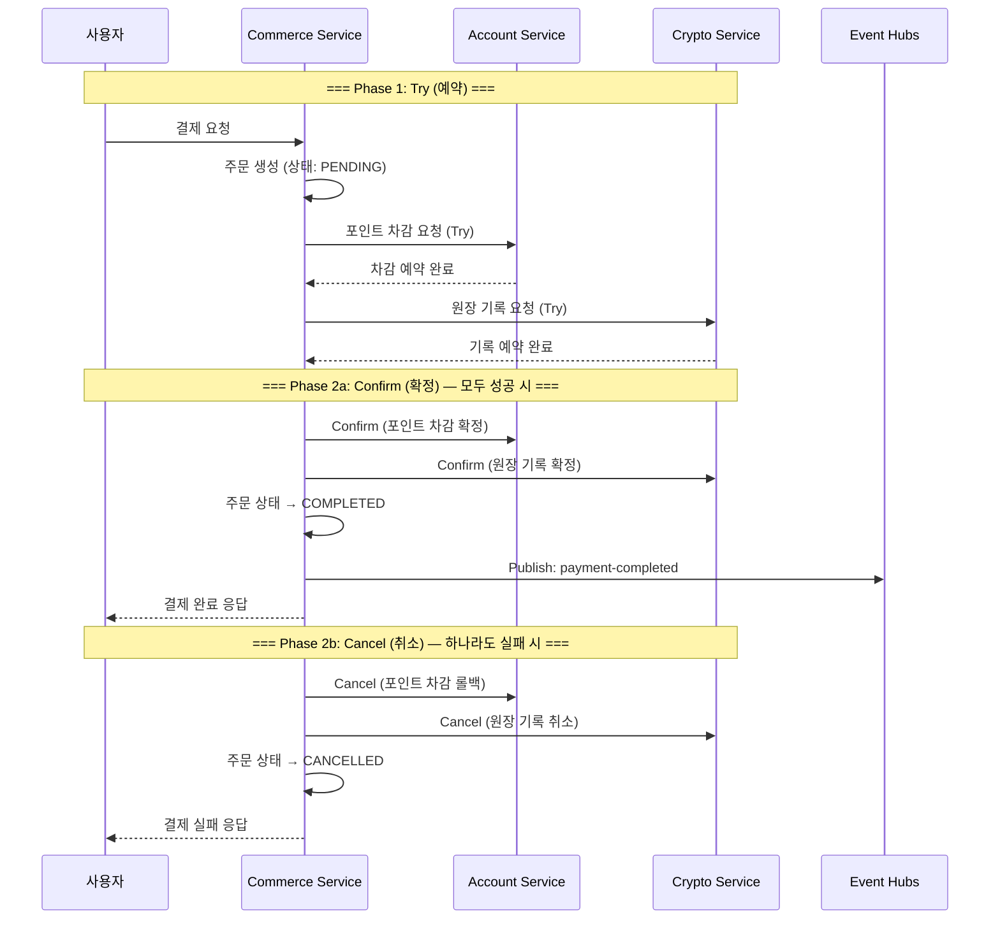

**TCC 3단계 요약:**

| 단계 | 역할 | 비유 |
|:---|:---|:---|
| **Try** | 각 서비스가 리소스를 **예약** (아직 확정 아님) | 식당 예약 — 자리를 잡아두지만 아직 주문은 안 함 |
| **Confirm** | 모든 Try가 성공하면 **확정** | 예약한 식당에 도착해서 주문 확정 |
| **Cancel** | 하나라도 실패하면 예약을 **취소(보상 트랜잭션)** | 일행이 못 오면 예약 취소 |

**서비스별 TCC 동작:**

| 서비스 | Try (예약) | Confirm (확정) | Cancel (보상) |
|:---|:---|:---|:---|
| **Commerce** | 주문 생성 (PENDING) | 주문 상태 → COMPLETED | 주문 상태 → CANCELLED |
| **Account** | 포인트 잔액에서 차감 예약 (Hold) | Hold 해제 → 실제 차감 확정 | Hold 해제 → 잔액 복구 |
| **Crypto** | 원장 기록 임시 저장 (DRAFT) | DRAFT → CONFIRMED (불변 기록) | DRAFT 삭제 |

> **핵심 원칙**: Confirm과 Cancel은 **멱등성(Idempotent)**을 보장해야 합니다. 즉, 같은 요청을 여러 번 보내도 결과가 동일해야 합니다. 네트워크 장애로 중복 호출되더라도 안전합니다.

---

### 6.5 토픽-구독자 매핑표 (Topic-Subscriber Matrix)

> **목적**: 6.2의 다이어그램에서 한눈에 보기 어려운 **토픽별 Publisher/Subscriber 관계**를 표로 정리합니다.

#### 토픽 정의

| Kafka 토픽 | Publisher | 발행 시점 | 메시지 페이로드 (주요 필드) |
|:---|:---|:---|:---|
| `payment-completed` | Commerce | 결제 확정 (TCC Confirm) 시 | `orderId`, `userId`, `amount`, `currency`, `timestamp` |
| `user-registered` | Account | 회원가입 완료 시 | `userId`, `email`, `tier`, `timestamp` |
| `ledger-entry-created` | Crypto | 원장 기록 확정 시 | `entryId`, `txHash`, `amount`, `ledgerType`, `timestamp` |

#### 구독자 매핑

| Kafka 토픽 | Subscriber | 처리 내용 | 실패 시 |
|:---|:---|:---|:---|
| `payment-completed` | **Account** | 결제 금액 기반 포인트 적립 | DLQ → 수동 적립 |
| `payment-completed` | **Crypto** | 결제 완료에 대한 원장 최종 기록 | DLQ → 수동 기록 |
| `payment-completed` | **Sync Consumer** | Backoffice DB에 결제 내역 Upsert | DLQ → 재처리 |
| `payment-completed` | **Databricks** | 실시간 매출 대시보드 업데이트 | Skip (배치로 보완) |
| `user-registered` | **Commerce** | 신규 회원 웰컴 혜택 (쿠폰 발급) | DLQ → 수동 발급 |
| `user-registered` | **Sync Consumer** | Backoffice DB에 회원 정보 Upsert | DLQ → 재처리 |
| `user-registered` | **Databricks** | 회원 가입 트렌드 분석 | Skip (배치로 보완) |
| `ledger-entry-created` | **Sync Consumer** | Backoffice DB에 원장 내역 Upsert | DLQ → 재처리 |
| `ledger-entry-created` | **Databricks** | 암호화폐 거래 분석 | Skip (배치로 보완) |

> **Databricks의 실패 처리가 "Skip"인 이유**: 실시간 스트리밍이 일시적으로 실패해도, SQL DB → ADLS Gen2 **일일 배치(Daily Dump)**가 백업 파이프라인으로 작동합니다. 따라서 데이터 유실 없이 배치 주기에 자동 보완됩니다.

---

### 6.6 모니터링 알림 흐름도 (Observability Flow)

> **목적**: 장애가 발생했을 때 **누가, 어떻게, 얼마나 빨리** 알림을 받는지 보여줍니다.

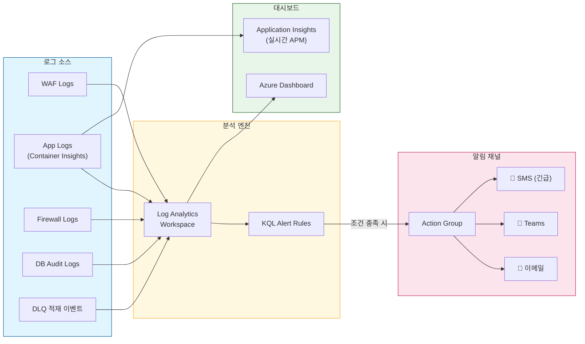

**Alert Rule 정의:**

| Alert 이름 | 조건 (KQL) | 심각도 | 알림 채널 | 설명 |
|:---|:---|:---|:---|:---|
| **High CPU on AKS** | `Perf \| where CounterName == "% Processor Time" \| where CounterValue > 80` | Sev 2 (Warning) | 이메일 + Teams | AKS 노드 CPU 80% 초과 시 |
| **DLQ Message Detected** | `AzureDiagnostics \| where Category == "DeadLetteredMessages" \| where count_ > 0` | Sev 1 (Error) | 이메일 + Teams + SMS | Dead Letter Queue에 메시지 적재 시 |
| **Firewall Deny Spike** | `AzureDiagnostics \| where msg_s contains "Deny" \| summarize count() by bin(TimeGenerated, 5m) \| where count_ > 50` | Sev 2 (Warning) | 이메일 + Teams | 5분간 차단 50건 초과 시 (공격 가능성) |
| **WAF Attack Detected** | `AzureDiagnostics \| where action_s == "Blocked" \| summarize count() by bin(TimeGenerated, 1m) \| where count_ > 10` | Sev 1 (Error) | 이메일 + Teams + SMS | 1분간 WAF 차단 10건 초과 시 |
| **API Latency High** | `requests \| where duration > 2000 \| summarize count() by bin(timestamp, 5m) \| where count_ > 20` | Sev 2 (Warning) | 이메일 | API 응답 2초 초과가 5분간 20건 이상 시 |
| **DB Connection Failed** | `AzureDiagnostics \| where Category == "SQLSecurityAuditEvents" \| where action_name_s == "FAILED_LOGIN"` | Sev 1 (Error) | 이메일 + Teams | DB 로그인 실패 감지 |

**SLA 기준 (Service Level Agreement):**

| 지표 | 목표값 | 측정 방법 |
|:---|:---|:---|
| **가용성 (Availability)** | 99.9% (월간 다운타임 43분 이내) | Application Insights 가용성 테스트 |
| **API 응답 시간 (P95)** | < 500ms | Application Insights 요청 추적 |
| **결제 처리 시간 (P95)** | < 2,000ms | Custom Metric (Commerce Service) |
| **이벤트 처리 지연 (Lag)** | < 30초 | Event Hubs Consumer Lag 메트릭 |
| **장애 감지 → 알림** | < 5분 | Alert Rule 평가 주기 |
| **DLQ 재처리** | 24시간 이내 | 운영 SOP |

---

## 7. 배포 설정 매트릭스 (Deployment Configuration Matrix)

> 2.3.1 레이어별 리소스 목록의 각 리소스를 실제 배포 시 **리소스 설정**, **네트워크 설정**, **보안 설정** 3개 축으로 정리합니다.

---

### 7.1 리소스 설정 (Resource Configuration)

> SKU, Tier, 용량 등 리소스 자체의 배포 설정입니다.

| Layer | 리소스 | SKU / Tier | 용량 / 규모 | 가용성 | 비고 |
|:---|:---|:---|:---|:---|:---|
| 2 | **Application Gateway** | WAF_v2 | Medium, AutoScale (2–10) | Zone Redundant | WAF v2만 Prevention 모드 지원 |
| 2 | **WAF Policy** | OWASP CRS 3.2 | Prevention Mode | — | Request Body 128KB, Upload 100MB |
| 3 | **AKS** | Standard | Node Pool: Standard_D4s_v3 × 3 | AutoScaler (3–10) | System + User Node Pool 분리 ¹² |

> **§7.1 배포 변경 이력 (2026-02-23):**
>
> ¹ `node_count = 3` → **코드에서 제거**. `enable_auto_scaling = true` 활성화 시 `node_count` 직접 지정 불가 (Terraform 에러 방지). 최소 노드 수는 `min_count = 3`으로 동일하게 보장됨.
>
> ² `upgrade_settings { max_surge = "10%" }` → **코드에 추가**. Azure가 AKS 생성 시 자동으로 적용하는 기본값이나, Terraform import 후 코드에 명시하지 않으면 매 apply마다 diff가 발생하여 명시적으로 추가.
>
> ³ `local_account_disabled = false` → **임시 변경**. 원래 `true`(§7.3 보안 설정 준수)이나, `az aks get-credentials`를 통한 kubectl 초기 접근을 위해 `false`로 설정. 클러스터 안정화 후 `true`로 재전환 예정.
| 3 | **AKS – Pods** | — | Account(2), Commerce(2), Crypto(2), SyncConsumer(1), AdminAPI(1) | HPA | Resources: 256Mi–512Mi RAM |
| 3 | **Bastion** | Standard | 2 Instances | — | Native Client 지원 (SSH/RDP) |
| 4 | **Event Hubs** | Standard | 2 TU (Throughput Units) | AutoInflate (10 TU) | Kafka Protocol 활성화 |
| 5 | **Azure SQL Database** | General Purpose | vCore 2, 32GB Storage | Zone Redundant | 자동 백업 7일 |
| 5 | **PostgreSQL (Backoffice)** | Flexible Server, Burstable B1ms | 32GB Storage | — | 읽기 위주 워크로드 |
| 5 | **Confidential Ledger** | Standard | — | — | Append-Only, 노드 3개 합의 |
| 6 | **Key Vault** | Standard | — | — | Soft Delete 90일, Purge Protection 활성화 |
| 6 | **Container Registry** | Premium | 500GB Storage | Geo-Replication | Content Trust 활성화 |
| 6 | **Private DNS Zone** | — | 7개 Zone (PE당 1개) | — | Auto-Registration 비활성화 |
| 7 | **Databricks** | Premium | Standard_DS3_v2 (Driver+Worker) | AutoScale (2–8 Workers) | Unity Catalog, VNet Injection |
| 7 | **ADLS Gen2** | Standard, LRS | Hot Tier | — | Hierarchical Namespace 활성화 |
| 8 | **Azure Firewall** | Standard | — | Zone Redundant | Threat Intelligence: Alert |
| 9 | **Log Analytics** | Pay-per-GB | 30일 Retention | — | Diagnostic Settings 연동 |
| 9 | **Application Insights** | Workspace-based | — | — | Log Analytics 통합 |

---

### 7.2 네트워크 설정 (Network Configuration)

> 각 리소스의 서브넷, NSG, UDR, Private Endpoint 설정입니다.

| Layer | 리소스 | 서브넷 | CIDR (예시) | NSG | UDR | Private Endpoint | Public IP |
|:---|:---|:---|:---|:---|:---|:---|:---|
| 2 | **Application Gateway** | Perimeter | `10.0.0.0/24` | ✅ Inbound 443 Only | — | — | ✅ (Frontend) |
| 3 | **AKS Node Pool** | Application | `10.0.2.0/23` | ✅ deny-ssh-internet, allow-from-gw | ✅ route-to-firewall | — | ❌ |
| 3 | **Admin UI** | Admin Portal | `10.0.10.0/28` | ✅ allow-from-appgw | — | — | ❌ |
| 3 | **Bastion** | AzureBastionSubnet | `10.0.1.0/26` | ✅ (Azure 관리) | — | — | ✅ (Bastion PIP) |
| 4 | **Event Hubs** | Messaging | `10.0.3.0/24` | ✅ allow-kafka-9093 | — | ✅ `privatelink.servicebus.windows.net` | ❌ |
| 5 | **SQL Database** | Data | `10.0.4.0/24` | ✅ deny-all-inbound | ✅ route-to-firewall | ✅ `privatelink.database.windows.net` | ❌ |
| 5 | **PostgreSQL** | Data | `10.0.4.0/24` | ✅ deny-all-inbound | ✅ route-to-firewall | ✅ `privatelink.postgres.database.azure.com` | ❌ |
| 5 | **Confidential Ledger** | Data | `10.0.4.0/24` | ✅ deny-all-inbound | ✅ route-to-firewall | ✅ `privatelink.confidential-ledger.azure.com` | ❌ |
| 6 | **Key Vault** | Security | `10.0.5.0/24` | — | — | ✅ `privatelink.vaultcore.azure.net` | ❌ |
| 6 | **Container Registry** | Security | `10.0.5.0/24` | — | — | ✅ `privatelink.azurecr.io` | ❌ |
| 6 | **Private DNS Zone** | — (VNet Link) | — | — | — | — | ❌ |
| 7 | **Databricks** | Analytics | `10.0.6.0/23` | ✅ (VNet Injection) | ✅ route-to-firewall | — | ❌ |
| 7 | **ADLS Gen2** | Analytics | `10.0.6.0/23` | — | — | ✅ `privatelink.dfs.core.windows.net` | ❌ |
| 8 | **Azure Firewall** | Egress | `10.0.8.0/26` | — (Firewall 자체가 필터링) | — | — | ✅ (SNAT PIP) |
| 9 | **Log Analytics** | VNet 외부 | — | — | — | — | ✅ (SaaS) |
| 9 | **Application Insights** | VNet 외부 | — | — | — | — | ✅ (SaaS) |

> **Public IP 최소화 원칙**: Public IP는 **Application Gateway**(Frontend), **Bastion**, **Firewall**(SNAT) 3개에만 할당하며, 나머지는 모두 Private Endpoint로 공인 IP 없이 접근합니다.

---

### 7.3 보안 설정 (Security Configuration)

> 각 리소스의 인증, 암호화, 접근 제어 설정입니다.

| Layer | 리소스 | 인증 방식 | 데이터 암호화 | 접근 제어 | Diagnostic Logs |
|:---|:---|:---|:---|:---|:---|
| 2 | **Application Gateway** | — (L7 라우팅) | TLS 1.2 (Frontend) | WAF Prevention + OWASP 3.2 | ✅ WAF Logs → Log Analytics |
| 3 | **AKS** | Workload Identity | etcd: Azure-managed Key | RBAC + Azure AD Integration | ✅ Container Insights |
| 3 | **AKS Pods** | Managed Identity | In-transit TLS | Network Policy (Calico) | ✅ stdout → Log Analytics |
| 3 | **Bastion** | Azure AD + MFA | End-to-End TLS | NSG + Azure 관리 | ✅ Session Logs |
| 4 | **Event Hubs** | SAS Token / Managed Identity | TLS 1.2 In-transit | Kafka SASL_SSL | ✅ Kafka Metrics |
| 5 | **SQL Database** | Managed Identity | TDE (AES-256 at-rest) | PE Only + Firewall Deny Public | ✅ Audit Logs |
| 5 | **PostgreSQL** | Managed Identity | SSL Enforced, at-rest | PE Only + VNet Delegation | ✅ pgAudit |
| 5 | **Confidential Ledger** | Certificate / AAD | SGX Enclave (TEE) | PE Only | ✅ Immutable Audit |
| 6 | **Key Vault** | Managed Identity + RBAC | HSM-backed (AES-256) | PE Only + Purge Protection | ✅ Access Audit |
| 6 | **Container Registry** | Managed Identity | At-rest Encryption | PE Only + Content Trust | ✅ Registry Events |
| 7 | **Databricks** | Managed Identity (Unity Catalog) | At-rest (DBFS Encryption) | VNet Injection + Secret Scope | ✅ Job/Cluster Logs |
| 7 | **ADLS Gen2** | Managed Identity | SSE (AES-256) + TLS 1.2 | PE Only + ACL + RBAC | ✅ Storage Analytics |
| 8 | **Azure Firewall** | — (네트워크 장비) | — | FQDN Allowlist + Network Rules | ✅ AzFW App/Net Rule Logs |
| 9 | **Log Analytics** | Azure AD RBAC | At-rest Encryption | Workspace RBAC | — (자체가 수집대성) |
| 9 | **Application Insights** | Azure AD RBAC | At-rest Encryption | Workspace RBAC | — |

> **공통 보안 기준 (Security Baseline):**
> - 모든 서비스 간 통신: **TLS 1.2 이상** 강제
> - 모든 PaaS 리소스: **Public Network Access 차단** (Private Endpoint Only)
> - 모든 인증: **Managed Identity 우선** (비밀번호 없는 인증)
> - 모든 저장 데이터: **At-Rest Encryption** (AES-256 이상)
> - 모든 관리 접근: **Azure AD + MFA** 필수

---

### 7.4 네이밍 규칙 (Naming Convention)

> 모든 리소스는 **`nsc-`** 접두어로 시작합니다. Azure 제약으로 하이픈이 불가능한 리소스만 예외입니다.

**패턴**: `nsc-{리소스약어}-{환경}` (예: `nsc-rg-dev`)

| 리소스 | 약어 | 패턴 | 예시 (dev) |
|:---|:---|:---|:---|
| Resource Group | `rg` | `nsc-rg-{env}` | `nsc-rg-dev` |
| VNet | `vnet` | `nsc-vnet-{env}` | `nsc-vnet-dev` |
| Subnet | `snet` | `nsc-snet-{역할}` | `nsc-snet-perimeter` |
| NSG | `nsg` | `nsc-nsg-{역할}` | `nsc-nsg-app` |
| UDR | `udr` | `nsc-udr-{역할}` | `nsc-udr-app` |
| Application Gateway | `agw` | `nsc-agw-{env}` | `nsc-agw-dev` |
| WAF Policy | `waf` | `nsc-waf-{env}` | `nsc-waf-dev` |
| AKS | `aks` | `nsc-aks-{env}` | `nsc-aks-dev` |
| Bastion | `bas` | `nsc-bas-{env}` | `nsc-bas-dev` |
| Azure Firewall | `fw` | `nsc-fw-{env}` | `nsc-fw-dev` |
| Firewall Policy | `fwp` | `nsc-fwp-{env}` | `nsc-fwp-dev` |
| Event Hubs Namespace | `evh` | `nsc-evh-{env}` | `nsc-evh-dev` |
| SQL Server | `sql` | `nsc-sql-{env}` | `nsc-sql-dev` |
| PostgreSQL | `pg` | `nsc-pg-{env}` | `nsc-pg-dev` |
| Confidential Ledger | `cl` | `nsc-cl-{env}` | `nsc-cl-dev` |
| Key Vault | `kv` | `nsc-kv-{env}` | `nsc-kv-dev` |
| Databricks | `dbw` | `nsc-dbw-{env}` | `nsc-dbw-dev` |
| Log Analytics | `law` | `nsc-law-{env}` | `nsc-law-dev` |
| Application Insights | `ai` | `nsc-ai-{env}` | `nsc-ai-dev` |
| Public IP | `pip` | `nsc-pip-{역할}` | `nsc-pip-agw` |
| Private Endpoint | `pe` | `nsc-pe-{대상}` | `nsc-pe-sqldb` |
| Private DNS Zone | — | Azure 표준 FQDN | `privatelink.database.windows.net` |

**예외 (하이픈 불가 — Azure 제약):**

| 리소스 | 제약 | 패턴 | 예시 (dev) |
|:---|:---|:---|:---|
| **Storage Account (ADLS Gen2)** | 소문자+숫자만, 3~24자 | `nscst{env}{suffix}` | `nscstdev3a7k` |
| **Container Registry (ACR)** | 영숫자만, 5~50자 | `nscacr{env}{suffix}` | `nsccacrdev3a7k` |

> `{suffix}`는 Terraform `random_string`(6자)으로 글로벌 유니크 보장. Storage Account/ACR만 필요.
> `{env}`는 `dev` → `stg` → `prod` 순서로 환경 구분.

---

## 부록: 용어 사전 (Glossary)

> 문서에 등장하는 전문 용어를 카테고리별로 정리합니다.

### 인프라 기본 용어

| 용어 | 설명 | 비유 |
|:---|:---|:---|
| **VNet (Virtual Network)** | Azure 안에 만드는 가상 네트워크. 리소스가 사는 동네. | 아파트 단지 전체 |
| **서브넷 (Subnet)** | VNet 안에서 역할별로 나눈 구역 | 아파트 단지 안의 각 동(棟) |
| **CIDR** | 서브넷의 IP 주소 범위 표기법. 예: `10.0.0.0/24` = 256개 IP | 동의 호수 범위 (101호~356호) |
| **PaaS** | Platform as a Service. Azure가 서버 관리를 해주는 서비스. | 방만 쓰면 되고, 건물 관리는 건물주(Azure)가 함 |
| **IaaS** | Infrastructure as a Service. 서버(VM)를 직접 관리해야 함. | 땅만 빌리고 집은 직접 짓는 것 |
| **CaaS** | Container as a Service. 컨테이너 실행 환경을 제공. AKS가 대표적. | 컨테이너 박스에 넣으면 어디서든 똑같이 풀 수 있는 서비스 |
| **AKS** | Azure Kubernetes Service. 컨테이너(Docker)를 자동으로 배포/관리하는 서비스. | 택배 물류센터 — 박스(컨테이너)를 자동 정리하고 배송 |
| **SKU / Tier** | 리소스의 요금제/등급. Standard, Premium 등 | 핸드폰 요금제 (5만원 요금제 vs 10만원 요금제) |
| **Zone Redundant** | 데이터를 여러 물리적 가용 영역에 복사해두는 것 | 중요 서류를 본사, 지사, 창고 3곳에 각각 보관 |
| **AutoScale** | 트래픽에 따라 서버를 자동으로 늘리고 줄이는 것 | 손님이 많으면 계산대를 열고, 한가하면 닫는 것 |

### 네트워크 용어

| 용어 | 설명 | 비유 |
|:---|:---|:---|
| **NSG (Network Security Group)** | 서브넷 앞에 놓는 방화벽 규칙표. "이 IP에서 이 포트만 허용" | 건물 출입구의 출입 명부 |
| **UDR (User Defined Route)** | 트래픽의 길을 강제로 지정하는 것 | "이 문으로 나가면 안 돼, 저 문(Firewall)으로 돌아가" |
| **Private Endpoint (PE)** | PaaS 리소스에 내부 전용 IP를 붙여서, 인터넷 없이 내부에서만 접근 가능하게 만듬 | 직통 내선전화 — 외부 번호 없이 내선으로만 통화 |
| **VNet Integration / Delegation** | PaaS 리소스를 서브넷 안에 직접 배치하는 방식 (PE와 다름) | PE가 내선전화를 연결하는 거라면, Delegation은 아예 같은 사무실에 앉히는 것 |
| **Private DNS Zone** | Private Endpoint에 붙이는 내부 전화번호부. 내부 IP를 도메인 이름으로 해석. | 내선 전화번호부 (내선 1234 = 김대리) |
| **Public IP** | 인터넷에서 접근 가능한 공인 IP 주소 | 가게 간판에 적힌 전화번호 — 아무나 전화할 수 있음 |
| **SNAT** | 내부 IP를 하나의 공인 IP로 바꾸어서 외부에 나가는 것 | 회사 대표번호로 발신 — 받는 쪽은 개인번호 모름 |
| **L7 라우팅** | HTTP URL 경로 기반으로 트래픽을 분배 | 건물 안내데스크가 "회계팀은 3층, 영업팀은 5층"이라고 안내 |
| **FQDN** | Fully Qualified Domain Name. 전체 도메인 주소. 예: `api.upbit.com` | 전체 주소 (예: 서울시 강남구 역삼동 123번지) |
| **Allowlist** | 허용 목록. 이 목록에 있는 것만 통과 가능. | 출입 허가 명단 — 명단에 없으면 출입 불가 |

### 보안 용어

| 용어 | 설명 | 비유 |
|:---|:---|:---|
| **TLS 1.2** | 데이터를 이동할 때 암호화하는 프로토콜 | 택배를 잠금 상자에 넣어 보내기 |
| **AES-256** | 저장된 데이터를 암호화하는 알고리즘 (매우 강력) | 금고의 자물쇠 — 현존 컴퓨터로 뜻으려면 우주 나이보다 오래 걸림 |
| **TDE** | Transparent Data Encryption. SQL DB가 자동으로 저장 데이터를 암호화 | 금고에 넣는 걸 DB가 알아서 해줄 |
| **Managed Identity** | Azure가 자동으로 발급하는 신분증. 비밀번호 없이 인증. | 사원증 태깅으로 출입 |
| **Service Principal** | 사람이 아니라 프로그램용 계정 | 로봇 직원의 사원증 |
| **MFA** | Multi-Factor Authentication. 이중 인증 (비밀번호 + 핸드폰 인증 등) | 현관문 비밀번호 + 지문 인식 |
| **RBAC** | Role-Based Access Control. 역할 기반 접근 제어 | "인턴은 읽기만, 매니저는 수정도 가능" |
| **Zero Trust** | "아무도 믿지 않는다" 보안 원칙. 내부든 외부든 항상 검증. | 가족도 현관문 비밀번호 입력해야 함 |
| **WAF** | Web Application Firewall. 웹 공격(SQL Injection, XSS 등)을 차단 | 입구 보안 검색대 — 가방(요청) 내용물 검사 |
| **OWASP** | 웹 보안 취약점 표준 목록을 관리하는 국제 단체. CRS 3.2 = 룰셋 버전. | 공항 보안 매뉴얼의 국제 표준 |
| **Soft Delete** | 삭제해도 즉시 사라지지 않고 복구 가능한 기간이 있음 | 휴지통에 넣은 파일 — 아직 복구 가능 |
| **Purge Protection** | Soft Delete된 것조차 강제 삭제를 90일간 막는 것 | 휴지통 비우기 버튼이 90일간 잠김 |
| **Content Trust** | 컨테이너 이미지의 출처를 검증 | 정품 인증 마크 확인 |

### 데이터 / 분석 용어

| 용어 | 설명 | 비유 |
|:---|:---|:---|
| **CDC** | Change Data Capture. DB의 변경 사항을 실시간으로 캡처 | CCTV 녹화 — 뭐가 바뀌었는지 전부 기록 |
| **ETL** | Extract → Transform → Load. 원본 데이터를 가공해서 분석용 DB에 넣는 과정 | 원재료(Extract) → 요리(Transform) → 접시에 담기(Load) |
| **Medallion Architecture** | Bronze(원본) → Silver(정제) → Gold(분석용) 3단계 데이터 정제 | 광석 → 세공 → 보석 |
| **Data Lake** | 정형/비정형 데이터를 모두 저장하는 대규모 저장소 | 모든 종류의 물건을 다 넣을 수 있는 대형 창고 |
| **ADLS Gen2** | Azure Data Lake Storage Gen2. Azure의 Data Lake 서비스. | Azure 전용 대형 창고 |
| **Kafka** | 대용량 이벤트 스트리밍 플랫폼. Event Hubs가 Kafka 프로토콜을 지원. | 대형 게시판 — 글 올리면 구독자들이 알아서 읽어감 |
| **Pub/Sub** | Publish/Subscribe. 메시지를 보내는 쪽과 받는 쪽이 서로 모름 | 라디오 방송 — 방송국이 송출하면 주파수 맞춘 사람만 들음 |
| **Secret Scope** | Databricks에서 Key Vault의 시크릿을 가져오는 연동 방식 | Key Vault 금고의 열쇠를 Databricks한테 빌려주는 것 |

### 애플리케이션 용어

| 용어 | 설명 | 비유 |
|:---|:---|:---|
| **마이크로서비스** | 하나의 큰 앱을 기능별 작은 서비스로 쪼갬 것 | 대형 마트 대신 전문 매장(정육점, 빵집, 과일가게) 각각 운영 |
| **Spring Boot** | Java 기반 웹 프레임워크. Account, Commerce 서비스가 사용. | Java 세계의 요리 레시피북 |
| **FastAPI** | Python 기반 웹 프레임워크. Crypto 서비스가 사용. | Python 세계의 초고속 요리 레시피북 |
| **HPA** | Horizontal Pod Autoscaler. 트래픽에 따라 Pod 수를 자동 조절. | 손님 많으면 알바생 추가 투입 |
| **Terraform** | 인프라를 코드로 관리하는 도구 (IaC) | 건축 설계도 — 설계도(코드) 하나로 똑같은 건물을 반복 시공 가능 |
| **IaC** | Infrastructure as Code. 인프라를 수동 클릭 대신 코드로 관리. | 레시피(코드)대로 만들면 누가 만들어도 같은 요리 |

### Azure 서비스 이름

| 서비스 | 역할 | 설명 |
|:---|:---|:---|
| **Application Gateway** | 입구 | HTTPS 트래픽을 받아서 적절한 서비스로 보내주는 L7 로드밸런서 |
| **Azure Firewall** | 출구 | 나가는 트래픽을 검사해서 허용 목록에 있는 곳만 통과시킴 |
| **Azure Bastion** | 운영 접근 | 공인 IP 없이 SSH/RDP 접속하게 해주는 보안 터널 서비스 |
| **Event Hubs** | 이벤트 브로커 | 대용량 이벤트를 수집·분배하는 메시지 브로커 (Kafka 호환) |
| **Key Vault** | 비밀 관리 | 비밀번호, API 키, 인증서를 안전하게 저장하는 금고 |
| **ACR** | 이미지 저장 | Azure Container Registry. 컨테이너 이미지 전용 저장소 |
| **Databricks** | 데이터 분석 | Apache Spark 기반 빅데이터 분석 플랫폼 |
| **Confidential Ledger** | 변조방지 원장 | 한번 쓰면 수정/삭제 불가능한 기록 장부 (블록체인 유사) |
| **Log Analytics** | 로그 분석 | 모든 리소스의 로그를 수집하고 KQL로 검색/분석하는 서비스 |
| **Application Insights** | APM | 앱 성능을 실시간 추적하는 모니터링 서비스 |
