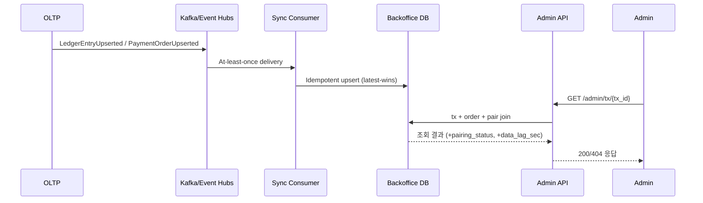

# tx-lookup-service

Backoffice Serving Layer for **FR-ADM-02 (거래 내역 추적)**.

이 저장소는 OLTP 거래 이벤트를 동기화해 Backoffice DB를 구성하고, Admin API로 `tx_id` 기반 조회를 제공한다.  
목표는 관리자 조회 경로에서 near real-time(초 단위) 응답을 안정적으로 제공하는 것이다.

## 프로젝트 개요

- 요구사항: `.specs/requirements/SRS - Software Requirements Specification.md`의 `FR-ADM-02`
- 핵심 기능:
  - `tx_id` 단건 조회
  - `order_id` 기준 조회
  - `wallet_id` 기준 거래 리스트 조회
- 구성 요소:
  - **Admin API** (`src/api/`): FastAPI 기반 조회 엔드포인트
  - **Sync Consumer** (`src/consumer/`): Kafka 이벤트 consume + 멱등 upsert
  - **Backoffice DB** (`src/db/`, `migrations/`): 조회 최적화된 파생 저장소

## 책임 경계와 범위

### In-scope

- Admin 조회 API 제공 (`/admin/*`)
- OLTP 이벤트를 Backoffice DB로 동기화
- 페어링 계산(`PAYMENT`/`RECEIVE`) 및 조회 응답 조립
- 감사로그/관측 지표 기록

### Out-of-scope

- 결제/정산 트랜잭션 처리 자체(Freeze/Settle/Rollback)
- 고객-facing 실시간 API
- 카프카 producer 구현

### 책임 분리 (DEC-112)

- 이 저장소는 **consumer-only**다.
- 이벤트 발행(producer)은 업스트림 서비스(CryptoSvc, AccountSvc, CommerceSvc) 소유다.
- 카프카/모니터링 인프라 프로비저닝은 인프라팀 소유다.

## 아키텍처와 데이터 흐름

```text
OLTP DB -> Kafka/Event Hubs -> Sync Consumer -> Backoffice DB -> Admin API -> Admin Tools/UI
```



## 핵심 도메인/데이터 모델

- `tx_id`: 원장 엔트리(행) PK
- `related_id`: 페어링 키(기본 `payment_orders.order_id`)
- 더블 엔트리: `PAYMENT`와 `RECEIVE`는 서로 다른 `tx_id`를 가지며 `related_id`로 연결

주요 테이블(스키마: `bo`)

- `bo.ledger_entries`: 원장 엔트리 파생 저장소 (PK `tx_id`)
- `bo.payment_orders`: 결제 오더 파생 저장소 (PK `order_id`)
- `bo.payment_ledger_pairs`: 결제 페어링 상태 (PK `payment_order_id`)
- `bo.admin_audit_logs`: 관리자 조회 감사로그 (`result_count` 포함)
- `bo.consumer_dlq_events`: Consumer 실패 이벤트 DLQ 저장소 (`DLQ_BACKEND=db`일 때 사용)

## Admin API 계약 요약

기본 문서:

- Swagger UI: `http://localhost:8000/docs`
- ReDoc: `http://localhost:8000/redoc`

엔드포인트

| 메서드 | 경로 | 주요 동작 |
|---|---|---|
| `GET` | `/admin/tx/{tx_id}` | 거래 단건 조회. 미존재 시 `404`. |
| `GET` | `/admin/payment-orders/{order_id}` | 주문 기준 조회. 미존재 시 `404`. |
| `GET` | `/admin/wallets/{wallet_id}/tx` | 지갑 거래 목록 조회. 빈 목록이어도 `200`. |

`GET /admin/tx/{tx_id}` 응답 규칙

- `tx_id` 미존재: `404`
- 페어링 완성: `pairing_status=COMPLETE`
- 페어링 미완성: `pairing_status=INCOMPLETE` (`paired_tx_id` 등 nullable)
- `related_id` 없거나 결제 주문 문맥이 아닌 경우: `pairing_status=UNKNOWN`
- `data_lag_sec`: `now - max(ingested_at, event_time)` 기준(가용 값 사용)

`GET /admin/wallets/{wallet_id}/tx` 쿼리 파라미터

- `from`: 조회 시작 시각(ISO 8601, optional)
- `to`: 조회 종료 시각(ISO 8601, optional)
- `limit`: 기본 `20`, 범위 `1..100`

권한/인증

- `AUTH_MODE=disabled`: 로컬 개발용(기본값)
- `AUTH_MODE=oidc`: JWT 검증 + 역할 체크
- 허용 역할: `ADMIN_READ` 또는 `ADMIN_AUDIT`

## 이벤트 계약 요약

기본 토픽(필수)

1. `ledger.entry.upserted` (`LEDGER_TOPIC`)
1. `payment.order.upserted` (`PAYMENT_ORDER_TOPIC`)

권장 필수 필드

- Ledger: `tx_id`, `wallet_id`, `entry_type`, `amount`, `related_id`, `event_time`(or `source_created_at`), `updated_at`(or `version`)
- Payment Order: `order_id`, `amount`, `status`, `created_at`, `updated_at`(or `version`)

참고:

- 상세 계약/샘플 payload: `configs/topic_checklist.md`
- `updated_at`/`version` 누락 시 consumer는 `ingested_at` 기준 last-write-wins로 수렴하고 누락 카운터를 관측한다.

## 로컬 개발 Quickstart

### 1) 의존 서비스 기동

```bash
docker compose up -d
```

### 2) Python 환경 준비

```bash
python3 -m venv .venv
. .venv/bin/activate
pip install -r requirements.txt
```

### 3) 환경 변수 로드

```bash
set -a
source configs/env.example
set +a
```

필요 시 `configs/README.md`를 참고해 Kafka 인증/OIDC/DB pool 값을 덮어쓴다.

### 4) DB 마이그레이션 적용

```bash
.venv/bin/alembic upgrade head
```

### 5) API 실행 (터미널 A)

```bash
.venv/bin/python -m uvicorn src.api.main:app --host 0.0.0.0 --port 8000 --reload
```

### 6) Consumer 실행 (터미널 B)

```bash
.venv/bin/python -m src.consumer.main consume
```

Consumer CLI

```bash
.venv/bin/python -m src.consumer.main --help
.venv/bin/python -m src.consumer.main consume --help
.venv/bin/python -m src.consumer.main backfill --help
```

## 스모크 / E2E 실행 경로

### A. API 스모크 (로컬 DB seed + TestClient)

```bash
.venv/bin/python scripts/smoke_admin_tx.py
```

### B. 이벤트 publish -> consume -> API 조회

샘플 이벤트 발행:

```bash
.venv/bin/python scripts/publish_sample_events.py
```

API 조회 예시:

```bash
curl http://localhost:8000/admin/tx/tx-payment-002
```

### C. E2E 테스트

사전 조건: PostgreSQL + Kafka 실행 중

```bash
.venv/bin/python -m pytest tests/e2e/test_admin_tx_e2e.py -x
```

## 테스트 / 검증 가이드

검증 명령은 프로젝트 venv 인터프리터를 사용한다.

- L0 (per edit):
  - `.venv/bin/python -m py_compile $(find src -name '*.py')`
- L1 (pre-commit):
  - `.venv/bin/python -m pytest tests/unit/ -x`
- L2 (pre-PR, coverage gate 80%):
  - `.venv/bin/python -m pytest --cov-fail-under=80`
- L3 (pre-merge):
  - Docker Compose 기반 E2E 스모크

검증 로그/evidence 경로: `.agents/logs/verification/`

## 보안 / 감사 / 관측성

### 보안

- 인증 모드: `AUTH_MODE=disabled|oidc`
- OIDC 모드에서 `AUTH_ISSUER`, `AUTH_AUDIENCE`, `AUTH_JWKS_URL` 필요
- 역할 체크: `ADMIN_READ` 또는 `ADMIN_AUDIT`

### 감사로그

모든 관리자 조회 요청(성공/404 포함)은 `bo.admin_audit_logs`에 기록된다.

- `who`: `actor_id`, `actor_roles`
- `when`: `requested_at`
- `what`: `action`, `resource_type`, `resource_id`
- `how`: `request_method`, `request_path`, `request_query`, `ip`, `user_agent`
- `result`: `result`, `status_code`, `duration_ms`, `result_count`

주의: 인증/인가 실패(`401/403`)는 라우트 진입 전 차단될 수 있으므로 API/게이트웨이 로그로 추적한다.

### 관측성

- OpenTelemetry + Azure Monitor(Application Insights) 연동
- `APPLICATIONINSIGHTS_CONNECTION_STRING`이 비어 있으면 OTel exporter 비활성화
- 상관관계 헤더: `X-Correlation-ID`

대표 메트릭:

- API: `api_request_latency_seconds`, `api_requests_total`, `api_requests_inflight`
- DB: `db_query_latency_seconds`, `db_pool_*`, `db_replication_lag_seconds`
- Consumer: `consumer_messages_total`, `consumer_event_lag_seconds`, `consumer_kafka_lag`, `consumer_freshness_seconds`, `consumer_dlq_total`
- Pairing: `pairing_total`, `pairing_incomplete_total`, `pairing_incomplete_age_seconds`

알림 규칙 레퍼런스: `docker/observability/alert_rules.yml`

## 참고 문서 (SSOT)

- 프로젝트 스펙: `.specs/backoffice_project_specs.md`
- DB/API 설계: `.specs/backoffice_db_admin_api.md`
- 데이터 동기화 스펙: `.specs/backoffice_data_project.md`
- 요구사항: `.specs/requirements/SRS - Software Requirements Specification.md`
- 의사결정 로그: `.specs/decision_open_items.md`
- 구현 로드맵: `.roadmap/implementation_roadmap.md`
- 환경 변수 가이드: `configs/README.md`
- 스크립트 가이드: `scripts/README.md`
