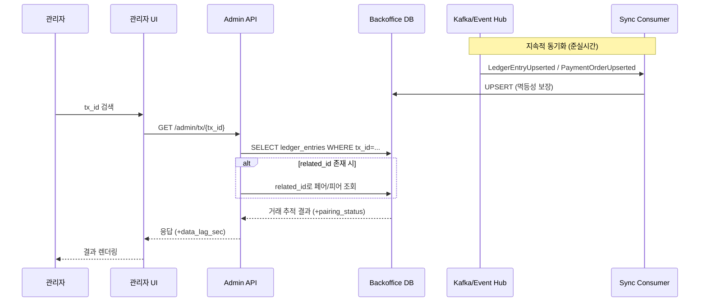

# tx-lookup-service

기획서의 FR-ADM-02(거래 내역 추적)를 구현하기 위한 서빙 레이어입니다.  
OLTP 원장 데이터를 Kafka로 동기화하고, Admin API로 tx_id 기반 조회를 제공합니다.

---

## 목적

- **FR-ADM-02**: 특정 트랜잭션 ID로 검색하면 시간, 보낸 사람, 받는 사람, 상태를 조회할 수 있습니다

---

## 구성 요소

| 컴포넌트 | 역할 |
|----------|------|
| **Admin API** | tx_id로 거래를 조회하는 REST API입니다 (FastAPI) |
| **Sync Consumer** | Kafka에서 이벤트를 받아 Serving DB에 저장합니다 (Python) |
| **Serving DB** | 조회에 최적화된 PostgreSQL입니다 (bo 스키마) |

---

## 아키텍처

OLTP DB → Kafka → [Sync Consumer] → Serving DB → [Admin API] → 관리자

---

## 주요 테이블

- `bo.ledger_entries` — 원장 엔트리를 저장합니다 (PK: tx_id)
- `bo.payment_orders` — 결제 오더를 저장합니다 (PK: order_id)
- `bo.payment_ledger_pairs` — PAYMENT/RECEIVE 페어링 결과를 저장합니다

---

## API 엔드포인트

| 메서드 | 경로 | 설명 |
|--------|------|------|
| GET | `/admin/tx/{tx_id}` | 단건 거래를 조회합니다 |
| GET | `/admin/payment-orders/{order_id}` | 오더 기준으로 조회합니다 |
| GET | `/admin/wallets/{wallet_id}/tx` | 지갑의 거래 내역을 조회합니다 |

> 각 엔드포인트의 요청/응답 스키마, 필드 설명, 예시 값, 에러 코드 등
> 상세 API 문서는 서버 실행 후 아래 주소에서 확인할 수 있습니다.
>
> - **Swagger UI**: `http://localhost:8000/docs`
> - **ReDoc**: `http://localhost:8000/redoc`

---

### 데이터 흐름

---

## 로컬 개발 환경

1. 의존 서비스 실행: `docker compose up -d`
1. 환경 변수 설정 (`configs/env.example` 및 `configs/README.md` 참고)
1. 구현 완료 후 API 또는 Consumer를 로컬에서 실행

---

## 관측성 (로컬)

- API 메트릭: `http://localhost:8000/metrics`
- Consumer 메트릭: `http://localhost:9108/metrics`
- Prometheus + Grafana (선택사항):
  - `docker compose -f docker-compose.observability.yml up -d`
  - Grafana: `http://localhost:3000` (기본 계정 `admin` / `admin`)
  - 알림 규칙: `docker/observability/alert_rules.yml` (API p95 200ms, 데이터 신선도 5s, 에러율 2%, DLQ 활동)

참고: `docker-compose.observability.yml`은 `network_mode: host`를 사용하므로 Prometheus/Grafana가 호스트의 메트릭 엔드포인트를 수집할 수 있습니다.
